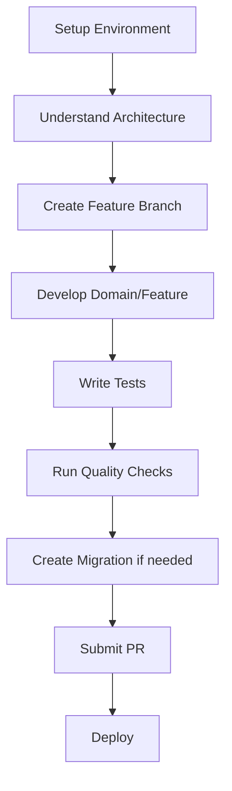

# FastAPI Enterprise Documentation

Welcome to the FastAPI Enterprise project documentation. This guide will help you understand, set up, and contribute to this enterprise-grade FastAPI application.

## 📚 Documentation Structure

### 🏗️ Architecture
- **[Application Architecture](architecture/application-architecture.md)** - Overall system design and patterns
- **[Folder Structure](architecture/folder-structure.md)** - Project organization and conventions
- **[Design Principles](architecture/design-principles.md)** - Guiding principles and best practices
- **[Database Architecture](architecture/database-architecture.md)** - Multi-database strategy and patterns

### 🛠️ Development
- **[Getting Started](development/getting-started.md)** - Project setup and first steps
- **[Adding New Features](development/adding-features.md)** - Feature development workflow
- **[Domain Development](development/domain-development.md)** - Creating new business domains
- **[API Development](development/api-development.md)** - Building and testing APIs
- **[Testing Guide](development/testing.md)** - Comprehensive testing strategy

### ⚙️ Operations
- **[Database Migrations](operations/database-migrations.md)** - Alembic migration management
- **[Celery Workers](operations/celery-workers.md)** - Background task management
- **[Docker Deployment](operations/docker-deployment.md)** - Containerization and deployment
- **[Environment Configuration](operations/environment-config.md)** - Settings and environment management
- **[Monitoring & Logging](operations/monitoring-logging.md)** - Observability and debugging

### 🚀 Features
- **[Pricing System](features/pricing-system.md)** - Manufacturing pricing calculations
- **[Cost Management](features/cost-management.md)** - Cost calculation and optimization
- **[Health Checks](features/health-checks.md)** - System monitoring and diagnostics

## 🎯 Quick Start

1. **[Getting Started](development/getting-started.md)** - Set up your development environment
2. **[Application Architecture](architecture/application-architecture.md)** - Understand the system design
3. **[Adding New Features](development/adding-features.md)** - Start contributing

## 🧭 Navigation

### New to the Project?
Start with [Getting Started](development/getting-started.md) and [Application Architecture](architecture/application-architecture.md).

### Adding Features?
Check out [Adding New Features](development/adding-features.md) and [Domain Development](development/domain-development.md).

### Working with Databases?
See [Database Migrations](operations/database-migrations.md) and [Database Architecture](architecture/database-architecture.md).

### Deploying or Operating?
Review [Docker Deployment](operations/docker-deployment.md) and [Environment Configuration](operations/environment-config.md).

### Need to Debug?
Check [Monitoring & Logging](operations/monitoring-logging.md) and [Testing Guide](development/testing.md).

## 📋 Development Workflow



## 🔧 Common Commands

```bash
# Development setup
make install-dev

# Run all quality checks
make check-all

# Run all tests
make test-all

# Database migration
make db-revision
make db-upgrade

# Docker deployment
make docker-up

# Background tasks
make celery-worker
make celery-beat
```

## 📞 Getting Help

- **Issues**: Check existing documentation first, then create GitHub issues
- **Architecture Questions**: See [Application Architecture](architecture/application-architecture.md)
- **Development Questions**: See [Development](development/) guides
- **Operations Questions**: See [Operations](operations/) guides

## 🤝 Contributing

1. Read the [Architecture](architecture/) documentation
2. Follow the [Development](development/) guidelines
3. Write comprehensive tests
4. Update documentation as needed
5. Follow the established patterns and conventions

---

*This documentation is maintained alongside the codebase. Please keep it updated as the project evolves.*
