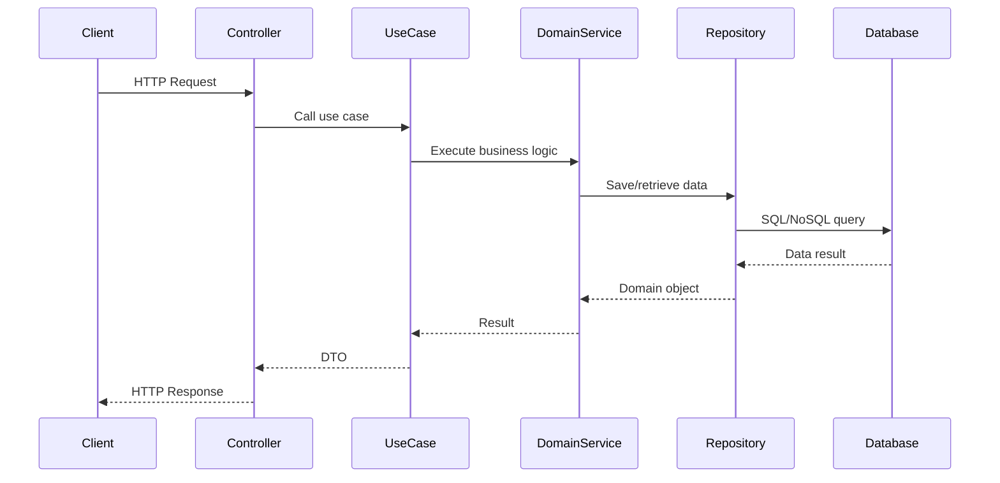

# Application Architecture

## Overview

The FastAPI Enterprise application follows **Hexagonal Architecture** (also known as Ports and Adapters) principles, promoting separation of concerns, testability, and maintainability. This architectural pattern isolates the core business logic from external concerns like databases, APIs, and user interfaces.

## Architecture Principles

### 1. Hexagonal Architecture (Ports and Adapters)

```
┌─────────────────────────────────────────────────────────────────┐
│                          External World                         │
│  ┌─────────────┐  ┌─────────────┐  ┌─────────────┐             │
│  │     Web     │  │   Database  │  │   External  │             │
│  │   Clients   │  │   Systems   │  │    APIs     │             │
│  └─────────────┘  └─────────────┘  └─────────────┘             │
│         │                │                │                    │
│         ▼                ▼                ▼                    │
│  ┌─────────────┐  ┌─────────────┐  ┌─────────────┐             │
│  │    HTTP     │  │  Database   │  │    HTTP     │             │
│  │   Adapter   │  │   Adapter   │  │   Client    │             │
│  └─────────────┘  └─────────────┘  └─────────────┘             │
│         │                │                │                    │
│         └────────────────┼────────────────┘                    │
│                          │                                     │
│  ┌─────────────────────────────────────────────────────────┐   │
│  │                 Application Core                        │   │
│  │  ┌─────────────┐  ┌─────────────┐  ┌─────────────┐     │   │
│  │  │   Domain    │  │  Use Cases  │  │    Ports    │     │   │
│  │  │   Models    │  │  (Services) │  │ (Interfaces)│     │   │
│  │  └─────────────┘  └─────────────┘  └─────────────┘     │   │
│  └─────────────────────────────────────────────────────────┘   │
└─────────────────────────────────────────────────────────────────┘
```

### 2. Domain-Driven Design (DDD)

- **Domains**: Separate business domains (pricing, cost, health)
- **Value Objects**: Immutable objects representing domain concepts
- **Entities**: Objects with identity and lifecycle
- **Services**: Stateless operations on domain objects
- **Repositories**: Abstract data access patterns

### 3. Clean Architecture Layers

1. **Domain Layer** (`app/core/domain/`): Pure business logic
2. **Application Layer** (`app/core/`): Use cases and application services
3. **Infrastructure Layer** (`app/adapter/outbound/`): External concerns
4. **Interface Layer** (`app/adapter/inbound/web/`): Web controllers and DTOs

## Directory Structure Deep Dive

### Core Application Structure

```
app/
├── __init__.py                 # Application package
├── main.py                     # FastAPI application entry point
├── api/                        # Interface Layer (Controllers)
│   ├── __init__.py
│   ├── v1/                     # API version 1
│   │   ├── __init__.py
│   │   ├── pricing.py          # Pricing endpoints
│   │   └── health.py           # Health check endpoints
│   ├── dependencies.py         # FastAPI dependency injection
│   ├── middleware.py           # HTTP middleware
│   └── errors.py               # Error handlers
├── core/                       # Application Layer (Use Cases)
│   ├── __init__.py
│   ├── config/                 # Configuration management
│   │   ├── __init__.py
│   │   ├── settings.py         # Pydantic settings
│   │   └── database.py         # Database configuration
│   ├── security/               # Security utilities (NOT CURRENTLY USED)
│   │   └── ...
│   └── exceptions.py           # Domain exceptions
├── domains/                    # Domain Layer (Business Logic)
│   ├── __init__.py
│   ├── pricing/                # Pricing domain
│   │   ├── __init__.py
│   │   ├── models.py           # Domain entities & value objects
│   │   ├── services.py         # Domain services
│   │   ├── repositories.py     # Repository interfaces (ports)
│   │   └── exceptions.py       # Domain-specific exceptions
│   ├── cost/                   # Cost calculation domain
│   │   ├── __init__.py
│   │   ├── models.py
│   │   ├── services.py
│   │   ├── repositories.py
│   │   └── exceptions.py
│   └── shared/                 # Shared domain concepts
│       ├── __init__.py
│       ├── value_objects.py    # Common value objects
│       └── base.py             # Base domain classes
└── infrastructure/             # Infrastructure Layer (Adapters)
    ├── __init__.py
    ├── database/               # Database adapters
    │   ├── __init__.py
    │   ├── postgres/           # PostgreSQL implementation
    │   │   ├── __init__.py
    │   │   ├── connection.py   # Connection management
    │   │   ├── repositories/   # Repository implementations
    │   │   │   ├── __init__.py
    │   │   │   ├── pricing.py  # Pricing repository
    │   │   │   └── cost.py     # Cost repository
    │   │   └── models.py       # SQLAlchemy models
    │   ├── mongodb/            # MongoDB implementation
    │   │   ├── __init__.py
    │   │   ├── connection.py
    │   │   ├── repositories/
    │   │   │   ├── __init__.py
    │   │   │   └── analytics.py
    │   │   └── models.py       # Beanie models
    │   └── redis/              # Redis implementation
    │       ├── __init__.py
    │       ├── connection.py
    │       └── cache.py        # Caching service
    ├── external/               # External service adapters
    │   ├── __init__.py
    │   ├── material_api.py     # Material data service
    │   └── shipping_api.py     # Shipping calculation service
    └── tasks/                  # Background task implementations
        ├── __init__.py
        ├── celery_app.py       # Celery configuration
        ├── pricing_tasks.py    # Pricing background tasks
        └── notification_tasks.py
```

## Architectural Patterns

### 1. Dependency Injection

FastAPI's dependency injection system manages object creation and lifecycle:

```python
# app/adapter/inbound/web/dependencies.py
from fastapi import Depends
from app.core.domain.pricing.repositories import PricingRepository
from app.adapter.outbound.persistence.repositories.pricing import PostgresPricingRepository

def get_pricing_repository() -> PricingRepository:
    return PostgresPricingRepository()

# Usage in endpoints
@router.post("/pricing")
async def calculate_pricing(
    request: PricingRequest,
    pricing_repo: PricingRepository = Depends(get_pricing_repository)
):
    # Business logic here
```

### 2. Repository Pattern

Abstract data access behind interfaces:

```python
# Domain layer (port)
class PricingRepository(ABC):
    @abstractmethod
    async def save_pricing_calculation(self, calculation: PricingCalculation) -> None:
        pass

# Infrastructure layer (adapter)
class PostgresPricingRepository(PricingRepository):
    async def save_pricing_calculation(self, calculation: PricingCalculation) -> None:
        # PostgreSQL-specific implementation
```

### 3. Domain Services

Encapsulate complex business logic:

```python
# app/core/domain/pricing/services.py
class PricingService:
    def __init__(self, cost_service: CostService, repository: PricingRepository):
        self._cost_service = cost_service
        self._repository = repository

    async def calculate_pricing(self, specification: PartSpecification) -> PricingResult:
        # Complex pricing calculation logic
        base_cost = await self._cost_service.calculate_base_cost(specification)
        # Apply business rules, tiers, discounts, etc.
        return pricing_result
```

### 4. Event-Driven Architecture

Use domain events for loose coupling:

```python
# Domain event
@dataclass
class PricingCalculated:
    calculation_id: UUID
    customer_id: UUID
    total_price: Decimal
    timestamp: datetime

# Event handler
class PricingEventHandler:
    async def handle_pricing_calculated(self, event: PricingCalculated) -> None:
        # Send notifications, update analytics, etc.
```

## Data Flow

### Request Processing Flow

1. **HTTP Request** → FastAPI router
2. **Controller** → Validates input, calls use case
3. **Use Case/Service** → Orchestrates domain logic
4. **Domain Service** → Applies business rules
5. **Repository** → Persists/retrieves data
6. **Response** → Returns formatted result



## Database Architecture

### Multi-Database Strategy

- **PostgreSQL**: Transactional data (pricing, customers, orders)
- **MongoDB**: Analytics, logs, document storage
- **Redis**: Caching, session storage, rate limiting

### Connection Management

Each database has its own connection pool and configuration:

```python
# app/core/config/database.py
class DatabaseSettings(BaseSettings):
    postgres_url: str = "postgresql+asyncpg://..."
    mongodb_url: str = "mongodb://..."
    redis_url: str = "redis://..."

    # Connection pool settings
    postgres_pool_size: int = 10
    postgres_max_overflow: int = 20
```

## Security Architecture

### Security

- **Input Validation**: Pydantic models for all API requests
- **Rate limiting** via Redis
- **HTTPS enforcement** in production
- **CORS configuration** for cross-origin requests

### Security Layers

1. **Input Validation**: Pydantic models
2. **Rate Limiting**: Redis-based throttling
3. **Data Validation**: Domain model validation
4. **HTTPS**: Encrypted connections in production

## Testing Architecture

### Test Pyramid

```
        ┌─────────────────┐
        │       E2E       │ ← Contract Tests
        │      Tests      │
        └─────────────────┘
      ┌───────────────────────┐
      │   Integration Tests   │ ← API Tests
      └───────────────────────┘
    ┌─────────────────────────────┐
    │        Unit Tests           │ ← Domain Tests
    └─────────────────────────────┘
```

- **Unit Tests**: Domain logic, services, utilities
- **Integration Tests**: Database interactions, external APIs
- **API Tests**: HTTP endpoint behavior
- **Contract Tests**: API contract validation

## Deployment Architecture

### Containerization

```dockerfile
# Multi-stage build for production
FROM python:3.11-slim as builder
# Build dependencies

FROM python:3.11-slim as runtime
# Runtime dependencies and application
```

### Service Architecture

```yaml
# docker-compose.yml structure
services:
  app:           # FastAPI application
  postgres:      # Primary database
  mongodb:       # Document database
  redis:         # Cache and sessions
  celery-worker: # Background tasks
  celery-beat:   # Scheduled tasks
  flower:        # Task monitoring
```

## Configuration Management

### Environment-Based Configuration

```python
# app/core/config/settings.py
class Settings(BaseSettings):
    environment: Environment = Environment.DEVELOPMENT
    debug: bool = False

    # Database URLs
    postgres_url: str
    mongodb_url: str
    redis_url: str

    # External services
    material_api_url: str
    shipping_api_key: str

    class Config:
        env_file = ".env"
        case_sensitive = False
```

## Monitoring & Observability

### Structured Logging

```python
import structlog

logger = structlog.get_logger(__name__)

# Context-aware logging
logger.info(
    "pricing_calculated",
    calculation_id=calculation.id,
    customer_id=request.customer_id,
    total_price=result.total_price
)
```

### Health Checks

- **Basic Health**: Application status
- **Detailed Health**: Database connectivity, external services
- **Readiness**: Application ready to serve traffic
- **Liveness**: Application is running

## Performance Considerations

### Caching Strategy

- **Application Cache**: Redis for frequently accessed data
- **Database Cache**: Connection pooling, query optimization
- **HTTP Cache**: Response caching for static data

### Async Processing

- **Background Tasks**: Celery for heavy computations
- **Async I/O**: AsyncIO for database and HTTP operations
- **Connection Pooling**: Efficient resource utilization

## Extension Points

### Adding New Domains

1. Create domain package in `app/core/domain/`
2. Define domain models and services
3. Implement repository interfaces
4. Add infrastructure adapters
5. Create API controllers
6. Add tests and documentation

### Adding External Integrations

1. Define port interface in domain layer
2. Implement adapter in infrastructure layer
3. Configure dependency injection
4. Add error handling and monitoring
5. Create integration tests

This architecture provides a solid foundation for building scalable, maintainable enterprise applications while maintaining clear separation of concerns and testability.
