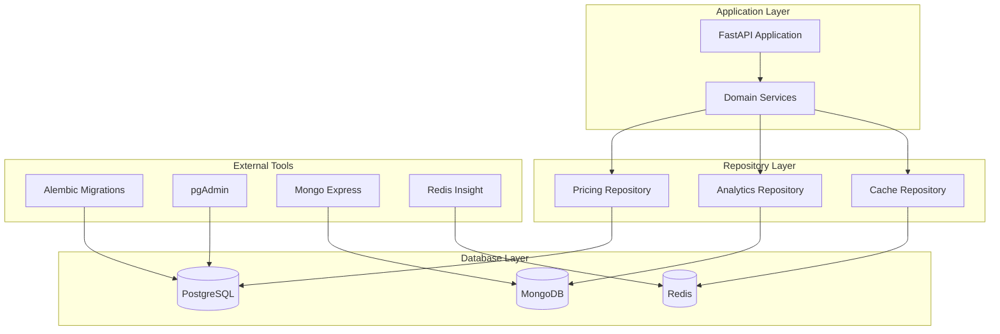

# Database Architecture

## Overview

The FastAPI Enterprise application implements a **polyglot persistence** strategy, using multiple database technologies optimized for different data patterns and use cases. This approach leverages the strengths of each database type while maintaining clean separation through the repository pattern.

## Multi-Database Strategy

### Database Selection by Use Case

| Database | Primary Use Cases | Data Characteristics | Access Patterns |
|----------|------------------|---------------------|-----------------|
| **PostgreSQL** | Transactional data, pricing calculations, user management | Structured, ACID compliance required | Complex queries, reporting |
| **MongoDB** | Analytics, logging, document storage | Semi-structured, flexible schema | Write-heavy, aggregations |
| **Redis** | Caching, session storage, rate limiting | Key-value, temporary data | High-frequency read/write |

### Architecture Diagram



## PostgreSQL - Transactional Database

### Purpose and Use Cases

- **Primary transactional data**: Orders, customers, pricing calculations
- **Complex business logic**: Multi-table transactions, foreign key constraints
- **Reporting and analytics**: Complex queries with joins and aggregations
- **User management**: User profiles and settings

### Schema Design

#### Core Tables

```sql
-- Users
CREATE TABLE users (
    id UUID PRIMARY KEY DEFAULT gen_random_uuid(),
    email VARCHAR(255) UNIQUE NOT NULL,
    hashed_password VARCHAR(255) NOT NULL,
    is_active BOOLEAN DEFAULT true,
    created_at TIMESTAMP WITH TIME ZONE DEFAULT NOW(),
    updated_at TIMESTAMP WITH TIME ZONE DEFAULT NOW()
);

-- Customer Management
CREATE TABLE customers (
    id UUID PRIMARY KEY DEFAULT gen_random_uuid(),
    user_id UUID REFERENCES users(id) ON DELETE CASCADE,
    company_name VARCHAR(255) NOT NULL,
    tier VARCHAR(50) NOT NULL DEFAULT 'standard',
    created_at TIMESTAMP WITH TIME ZONE DEFAULT NOW(),
    updated_at TIMESTAMP WITH TIME ZONE DEFAULT NOW()
);

-- Pricing Calculations
CREATE TABLE pricing_calculations (
    id UUID PRIMARY KEY DEFAULT gen_random_uuid(),
    customer_id UUID REFERENCES customers(id),
    material VARCHAR(100) NOT NULL,
    quantity INTEGER NOT NULL CHECK (quantity > 0),
    dimensions JSONB NOT NULL,
    geometric_complexity_score DECIMAL(3,2) CHECK (geometric_complexity_score BETWEEN 1.0 AND 5.0),
    process VARCHAR(100) NOT NULL,
    surface_finish VARCHAR(100),
    tolerance_class VARCHAR(100),
    special_requirements TEXT[],
    delivery_timeline VARCHAR(50),
    rush_order BOOLEAN DEFAULT false,
    cost_breakdown JSONB NOT NULL,
    pricing_tiers JSONB NOT NULL,
    estimated_weight_kg DECIMAL(10,4),
    created_at TIMESTAMP WITH TIME ZONE DEFAULT NOW(),
    updated_at TIMESTAMP WITH TIME ZONE DEFAULT NOW()
);

-- Cost Components
CREATE TABLE cost_components (
    id UUID PRIMARY KEY DEFAULT gen_random_uuid(),
    calculation_id UUID REFERENCES pricing_calculations(id) ON DELETE CASCADE,
    component_type VARCHAR(50) NOT NULL, -- 'material', 'labor', 'setup', 'overhead'
    description TEXT,
    unit_cost DECIMAL(12,4) NOT NULL,
    quantity DECIMAL(10,4) NOT NULL,
    total_cost DECIMAL(12,4) NOT NULL,
    created_at TIMESTAMP WITH TIME ZONE DEFAULT NOW()
);
```

#### Indexing Strategy

```sql
-- Performance indexes for common query patterns
CREATE INDEX idx_pricing_calculations_customer_created ON pricing_calculations(customer_id, created_at DESC);
CREATE INDEX idx_pricing_calculations_material_created ON pricing_calculations(material, created_at DESC);
CREATE INDEX idx_pricing_calculations_process ON pricing_calculations(process);
CREATE INDEX idx_cost_components_calculation_type ON cost_components(calculation_id, component_type);

-- Full-text search indexes
CREATE INDEX idx_customers_company_name_gin ON customers USING gin(to_tsvector('english', company_name));

-- JSONB indexes for complex queries
CREATE INDEX idx_pricing_calculations_dimensions ON pricing_calculations USING gin(dimensions);
CREATE INDEX idx_pricing_calculations_tiers ON pricing_calculations USING gin(pricing_tiers);
```

### Connection Management

```python
# app/adapter/outbound/database/postgres/connection.py
from sqlalchemy.ext.asyncio import create_async_engine, AsyncSession, async_sessionmaker
from sqlalchemy.pool import QueuePool

class PostgreSQLConnection:
    def __init__(self, database_url: str):
        self.engine = create_async_engine(
            database_url,
            poolclass=QueuePool,
            pool_size=10,
            max_overflow=20,
            pool_pre_ping=True,
            pool_recycle=3600,
            echo=False  # Set to True for SQL debugging
        )
        self.session_factory = async_sessionmaker(
            self.engine,
            class_=AsyncSession,
            expire_on_commit=False
        )

    async def get_session(self) -> AsyncSession:
        return self.session_factory()

    async def close(self):
        await self.engine.dispose()
```

### Repository Implementation

```python
# app/adapter/outbound/database/postgres/repositories/pricing.py
from sqlalchemy import select, desc
from sqlalchemy.orm import selectinload
from app.core.domain.pricing.repositories import PricingRepository
from app.core.domain.pricing.models import PricingCalculation

class PostgresPricingRepository(PricingRepository):
    def __init__(self, session_factory: async_sessionmaker):
        self._session_factory = session_factory

    async def save_calculation(self, calculation: PricingCalculation) -> None:
        async with self._session_factory() as session:
            db_calculation = PricingCalculationORM.from_domain(calculation)
            session.add(db_calculation)
            await session.commit()

    async def find_by_customer(
        self,
        customer_id: UUID,
        limit: int = 50
    ) -> List[PricingCalculation]:
        async with self._session_factory() as session:
            query = (
                select(PricingCalculationORM)
                .where(PricingCalculationORM.customer_id == customer_id)
                .order_by(desc(PricingCalculationORM.created_at))
                .limit(limit)
                .options(selectinload(PricingCalculationORM.cost_components))
            )
            result = await session.execute(query)
            orm_calculations = result.scalars().all()
            return [calc.to_domain() for calc in orm_calculations]
```

## MongoDB - Document Database

### Purpose and Use Cases

- **Analytics and reporting**: Pricing analytics, usage metrics, business intelligence
- **Logging and monitoring**: Application logs, audit trails, system events
- **Document storage**: Configuration files, templates, user preferences
- **Event sourcing**: Domain events, state changes, workflow tracking

### Document Structure

#### Pricing Analytics Collection

```javascript
// pricing_analytics collection
{
  "_id": ObjectId("..."),
  "calculation_id": "uuid-string",
  "customer_id": "uuid-string",
  "timestamp": ISODate("2024-01-15T10:30:00Z"),
  "pricing_data": {
    "material": "aluminum",
    "quantity": 100,
    "dimensions": {
      "length_mm": 150,
      "width_mm": 75,
      "height_mm": 25,
      "volume_cm3": 281.25
    },
    "geometric_complexity_score": 2.5,
    "process": "cnc",
    "total_price": 1250.00,
    "price_per_unit": 12.50
  },
  "cost_breakdown": {
    "material_cost": 400.00,
    "labor_cost": 600.00,
    "setup_cost": 150.00,
    "overhead_cost": 100.00
  },
  "market_data": {
    "material_price_per_kg": 2.50,
    "labor_rate_per_hour": 75.00,
    "market_trend": "stable"
  },
  "performance_metrics": {
    "calculation_time_ms": 45,
    "cache_hit_rate": 0.85,
    "api_response_time_ms": 120
  },
  "metadata": {
    "api_version": "v1",
    "user_agent": "...",
    "ip_address": "...",
    "session_id": "..."
  }
}
```

#### Application Logs Collection

```javascript
// application_logs collection
{
  "_id": ObjectId("..."),
  "timestamp": ISODate("2024-01-15T10:30:00Z"),
  "level": "INFO",
  "logger": "app.core.domain.pricing.services",
  "message": "Pricing calculation completed",
  "context": {
    "calculation_id": "uuid-string",
    "customer_id": "uuid-string",
    "material": "aluminum",
    "quantity": 100,
    "total_price": 1250.00,
    "processing_time_ms": 45
  },
  "trace_id": "trace-uuid",
  "span_id": "span-uuid",
  "environment": "production",
  "service_name": "fastapi-enterprise"
}
```

### Connection Management

```python
# app/adapter/outbound/database/mongodb/connection.py
from motor.motor_asyncio import AsyncIOMotorClient
from beanie import init_beanie

class MongoDBConnection:
    def __init__(self, database_url: str, database_name: str):
        self.client = AsyncIOMotorClient(database_url)
        self.database = self.client[database_name]

    async def initialize(self):
        # Initialize Beanie ODM with document models
        await init_beanie(
            database=self.database,
            document_models=[
                PricingAnalytics,
                ApplicationLog,
                UserActivity,
                SystemMetrics
            ]
        )

    async def close(self):
        self.client.close()
```

### Repository Implementation

```python
# app/adapter/outbound/database/mongodb/repositories/analytics.py
from beanie import Document
from app.core.domain.analytics.repositories import AnalyticsRepository

class PricingAnalytics(Document):
    calculation_id: str
    customer_id: str
    timestamp: datetime
    pricing_data: Dict[str, Any]
    cost_breakdown: Dict[str, float]
    market_data: Dict[str, Any]
    performance_metrics: Dict[str, float]
    metadata: Dict[str, str]

    class Settings:
        collection = "pricing_analytics"
        indexes = [
            "customer_id",
            "timestamp",
            "pricing_data.material",
            [("customer_id", 1), ("timestamp", -1)]
        ]

class MongoAnalyticsRepository(AnalyticsRepository):
    async def save_pricing_analytics(self, analytics: PricingAnalyticsData) -> None:
        document = PricingAnalytics(**analytics.dict())
        await document.insert()

    async def get_pricing_trends(
        self,
        material: str,
        days: int = 30
    ) -> List[PricingTrend]:
        pipeline = [
            {
                "$match": {
                    "pricing_data.material": material,
                    "timestamp": {
                        "$gte": datetime.utcnow() - timedelta(days=days)
                    }
                }
            },
            {
                "$group": {
                    "_id": {
                        "$dateToString": {
                            "format": "%Y-%m-%d",
                            "date": "$timestamp"
                        }
                    },
                    "avg_price": {"$avg": "$pricing_data.total_price"},
                    "count": {"$sum": 1}
                }
            },
            {"$sort": {"_id": 1}}
        ]

        results = await PricingAnalytics.aggregate(pipeline).to_list()
        return [PricingTrend.from_mongo(result) for result in results]
```

## Redis - In-Memory Database

### Purpose and Use Cases

- **Application cache**: Frequently accessed data, computed results
- **Session storage**: User sessions, temporary state
- **Rate limiting**: API throttling, request counting
- **Pub/Sub messaging**: Real-time notifications, event broadcasting
- **Distributed locks**: Coordination between application instances

### Data Structures and Patterns

#### Caching Strategy

```python
# app/adapter/outbound/redis/cache.py
import json
from typing import Optional, Any
from redis.asyncio import Redis

class RedisCache:
    def __init__(self, redis_client: Redis):
        self._redis = redis_client

    async def get(self, key: str) -> Optional[Any]:
        """Get cached value with automatic JSON deserialization"""
        value = await self._redis.get(key)
        if value:
            return json.loads(value)
        return None

    async def set(
        self,
        key: str,
        value: Any,
        ttl: int = 3600
    ) -> None:
        """Set cached value with automatic JSON serialization"""
        serialized = json.dumps(value, default=str)
        await self._redis.setex(key, ttl, serialized)

    async def get_or_set(
        self,
        key: str,
        factory_func: Callable[[], Awaitable[Any]],
        ttl: int = 3600
    ) -> Any:
        """Get from cache or execute factory function and cache result"""
        cached = await self.get(key)
        if cached is not None:
            return cached

        value = await factory_func()
        await self.set(key, value, ttl)
        return value

# Usage in services
class MaterialService:
    def __init__(self, cache: RedisCache, external_api: MaterialAPI):
        self._cache = cache
        self._external_api = external_api

    async def get_material_properties(self, material: str) -> MaterialProperties:
        cache_key = f"material:properties:{material}"

        return await self._cache.get_or_set(
            cache_key,
            lambda: self._external_api.fetch_material_data(material),
            ttl=3600  # Cache for 1 hour
        )
```

#### Rate Limiting

```python
# app/adapter/outbound/redis/rate_limiter.py
class RedisRateLimiter:
    def __init__(self, redis_client: Redis):
        self._redis = redis_client

    async def is_allowed(
        self,
        identifier: str,
        limit: int,
        window_seconds: int
    ) -> bool:
        """Sliding window rate limiter"""
        key = f"rate_limit:{identifier}"
        now = time.time()
        pipeline = self._redis.pipeline()

        # Remove expired entries
        pipeline.zremrangebyscore(key, 0, now - window_seconds)

        # Count current requests
        pipeline.zcard(key)

        # Add current request
        pipeline.zadd(key, {str(now): now})

        # Set expiration
        pipeline.expire(key, window_seconds)

        results = await pipeline.execute()
        current_requests = results[1]

        return current_requests < limit
```

#### Session Storage

```python
# app/adapter/outbound/redis/session.py
class RedisSessionStore:
    def __init__(self, redis_client: Redis, ttl: int = 1800):
        self._redis = redis_client
        self._ttl = ttl

    async def create_session(self, user_id: str, session_data: dict) -> str:
        session_id = str(uuid4())
        session_key = f"session:{session_id}"

        session_data.update({
            "user_id": user_id,
            "created_at": datetime.utcnow().isoformat(),
            "last_accessed": datetime.utcnow().isoformat()
        })

        await self._redis.hset(session_key, mapping=session_data)
        await self._redis.expire(session_key, self._ttl)

        return session_id

    async def get_session(self, session_id: str) -> Optional[dict]:
        session_key = f"session:{session_id}"
        session_data = await self._redis.hgetall(session_key)

        if session_data:
            # Update last accessed time
            await self._redis.hset(
                session_key,
                "last_accessed",
                datetime.utcnow().isoformat()
            )
            await self._redis.expire(session_key, self._ttl)

            return {k.decode(): v.decode() for k, v in session_data.items()}

        return None
```

## Data Consistency and Transactions

### Cross-Database Consistency

Since we're using multiple databases, we implement eventual consistency patterns:

#### Saga Pattern for Distributed Transactions

```python
# app/core/sagas/pricing_saga.py
class PricingCalculationSaga:
    def __init__(
        self,
        pricing_repo: PricingRepository,
        analytics_repo: AnalyticsRepository,
        cache: RedisCache
    ):
        self._pricing_repo = pricing_repo
        self._analytics_repo = analytics_repo
        self._cache = cache

    async def execute_pricing_calculation(
        self,
        calculation: PricingCalculation
    ) -> PricingResult:
        """Execute pricing calculation with cross-database consistency"""
        try:
            # Step 1: Save to PostgreSQL (transactional)
            await self._pricing_repo.save_calculation(calculation)

            # Step 2: Save analytics to MongoDB (eventual consistency)
            analytics_data = self._create_analytics_data(calculation)
            await self._analytics_repo.save_pricing_analytics(analytics_data)

            # Step 3: Update cache
            cache_key = f"recent_calculations:{calculation.customer_id}"
            await self._cache.invalidate_pattern(cache_key)

            return calculation.result

        except Exception as e:
            # Implement compensating actions
            await self._handle_saga_failure(calculation, e)
            raise

    async def _handle_saga_failure(
        self,
        calculation: PricingCalculation,
        error: Exception
    ) -> None:
        """Implement compensating actions for failed saga"""
        logger.error(
            "pricing_saga_failed",
            calculation_id=calculation.id,
            error=str(error)
        )

        # Compensating actions would go here
        # For example, marking calculation as failed in PostgreSQL
```

### Database Migration Strategy

#### PostgreSQL Migrations with Alembic

```python
# migrations/env.py
from alembic import context
from sqlalchemy import engine_from_config, pool
from app.adapter.outbound.persistence.models import Base

def run_migrations_online():
    """Run migrations in 'online' mode."""
    connectable = engine_from_config(
        config.get_section(config.config_ini_section),
        prefix="sqlalchemy.",
        poolclass=pool.NullPool,
    )

    with connectable.connect() as connection:
        context.configure(
            connection=connection,
            target_metadata=Base.metadata
        )

        with context.begin_transaction():
            context.run_migrations()
```

#### MongoDB Schema Evolution

```python
# app/adapter/outbound/database/mongodb/migrations.py
class MongoMigration:
    def __init__(self, database: AsyncIOMotorDatabase):
        self.database = database

    async def migrate_pricing_analytics_v2(self):
        """Add new fields to existing documents"""
        collection = self.database.pricing_analytics

        # Update documents that don't have the new field
        await collection.update_many(
            {"performance_metrics": {"$exists": False}},
            {
                "$set": {
                    "performance_metrics": {
                        "calculation_time_ms": 0,
                        "cache_hit_rate": 0.0,
                        "api_response_time_ms": 0
                    }
                }
            }
        )

    async def create_indexes(self):
        """Ensure all required indexes exist"""
        collections_indexes = {
            "pricing_analytics": [
                [("customer_id", 1), ("timestamp", -1)],
                [("pricing_data.material", 1)],
                [("timestamp", -1)]
            ],
            "application_logs": [
                [("timestamp", -1)],
                [("level", 1), ("timestamp", -1)],
                [("trace_id", 1)]
            ]
        }

        for collection_name, indexes in collections_indexes.items():
            collection = self.database[collection_name]
            for index in indexes:
                await collection.create_index(index)
```

## Monitoring and Performance

### Database Health Checks

```python
# app/adapter/outbound/database/health.py
class DatabaseHealthChecker:
    def __init__(
        self,
        postgres: PostgreSQLConnection,
        mongodb: MongoDBConnection,
        redis: Redis
    ):
        self._postgres = postgres
        self._mongodb = mongodb
        self._redis = redis

    async def check_all_databases(self) -> Dict[str, bool]:
        """Check health of all database connections"""
        checks = await asyncio.gather(
            self._check_postgres(),
            self._check_mongodb(),
            self._check_redis(),
            return_exceptions=True
        )

        return {
            "postgres": not isinstance(checks[0], Exception),
            "mongodb": not isinstance(checks[1], Exception),
            "redis": not isinstance(checks[2], Exception)
        }

    async def _check_postgres(self) -> bool:
        async with self._postgres.get_session() as session:
            result = await session.execute(text("SELECT 1"))
            return result.scalar() == 1

    async def _check_mongodb(self) -> bool:
        # Simple ping to check connectivity
        await self._mongodb.client.admin.command("ping")
        return True

    async def _check_redis(self) -> bool:
        pong = await self._redis.ping()
        return pong is True
```

### Performance Monitoring

```python
# app/adapter/outbound/database/monitoring.py
class DatabaseMonitor:
    def __init__(self):
        self.metrics = {
            "postgres_queries": 0,
            "postgres_slow_queries": 0,
            "mongodb_operations": 0,
            "redis_operations": 0,
            "cache_hits": 0,
            "cache_misses": 0
        }

    def record_postgres_query(self, duration_ms: float):
        self.metrics["postgres_queries"] += 1
        if duration_ms > 1000:  # Slow query threshold
            self.metrics["postgres_slow_queries"] += 1

    def record_cache_hit(self):
        self.metrics["cache_hits"] += 1

    def record_cache_miss(self):
        self.metrics["cache_misses"] += 1

    def get_cache_hit_rate(self) -> float:
        total = self.metrics["cache_hits"] + self.metrics["cache_misses"]
        if total == 0:
            return 0.0
        return self.metrics["cache_hits"] / total
```

This multi-database architecture provides the FastAPI Enterprise application with the flexibility to use the right database for each specific use case while maintaining clean separation of concerns through the repository pattern and ensuring data consistency through well-defined patterns and practices.
