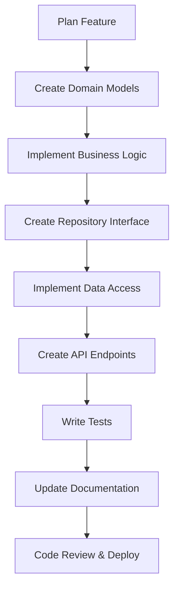

# Adding New Features

## Overview

This guide walks you through the process of adding new features to the FastAPI Enterprise application. We follow hexagonal architecture principles and domain-driven design to ensure features are maintainable, testable, and aligned with business requirements.

## Feature Development Workflow

### 1. Feature Planning Phase

Before writing code, understand the requirements:

- **Business Requirements**: What problem does this feature solve?
- **Domain Boundaries**: Which domain does this feature belong to?
- **Integration Points**: How does it interact with existing features?
- **Data Requirements**: What data needs to be stored/retrieved?
- **API Design**: What endpoints will be exposed?

### 2. Development Process



## Step-by-Step Implementation

### Step 1: Plan the Feature

Let's implement a **Quote Management** feature as an example:

**Requirements**:
- Customers can save pricing calculations as quotes
- Quotes have expiration dates and status (draft, sent, accepted, expired)
- Support quote versioning and history
- Email notifications for quote events

**Domain Analysis**:
- **Primary Domain**: `quotes` (new domain)
- **Related Domains**: `pricing` (dependency), `customers` (dependency)
- **External Services**: Email service, PDF generation

### Step 2: Create Domain Models

Create the domain structure:

```bash
mkdir -p app/core/domain/quotes
touch app/core/domain/quotes/__init__.py
touch app/core/domain/quotes/models.py
touch app/core/domain/quotes/services.py
touch app/core/domain/quotes/repositories.py
touch app/core/domain/quotes/exceptions.py
```

**Define domain models** (`app/core/domain/quotes/models.py`):

```python
from dataclasses import dataclass
from datetime import datetime, timedelta
from decimal import Decimal
from enum import Enum
from typing import Optional, List
from uuid import UUID, uuid4

from app.core.domain.shared.value_objects import Money
from app.core.domain.pricing.models import PricingCalculation

class QuoteStatus(Enum):
    DRAFT = "draft"
    SENT = "sent"
    ACCEPTED = "accepted"
    REJECTED = "rejected"
    EXPIRED = "expired"
    CANCELLED = "cancelled"

@dataclass(frozen=True)
class QuoteVersion:
    """Value object representing a version of a quote"""
    version: int
    pricing_calculation: PricingCalculation
    notes: str
    created_at: datetime

class Quote:
    """Quote aggregate root"""

    def __init__(
        self,
        customer_id: UUID,
        initial_pricing: PricingCalculation,
        valid_until: Optional[datetime] = None
    ):
        self.id = uuid4()
        self.customer_id = customer_id
        self.status = QuoteStatus.DRAFT
        self.created_at = datetime.utcnow()
        self.updated_at = datetime.utcnow()
        self.valid_until = valid_until or (datetime.utcnow() + timedelta(days=30))

        # Version history
        self._versions: List[QuoteVersion] = []
        self._current_version = 1

        # Add initial version
        self.add_version(initial_pricing, "Initial quote")

    @property
    def current_pricing(self) -> PricingCalculation:
        """Get the current pricing calculation"""
        if not self._versions:
            raise ValueError("Quote has no versions")
        return self._versions[-1].pricing_calculation

    @property
    def current_version(self) -> int:
        return self._current_version

    @property
    def is_expired(self) -> bool:
        return datetime.utcnow() > self.valid_until

    @property
    def total_price(self) -> Money:
        return self.current_pricing.total_price

    def add_version(self, pricing: PricingCalculation, notes: str = "") -> None:
        """Add a new version to the quote"""
        if self.status in [QuoteStatus.ACCEPTED, QuoteStatus.EXPIRED]:
            raise InvalidQuoteOperationError(
                f"Cannot modify quote in {self.status.value} status"
            )

        version = QuoteVersion(
            version=self._current_version,
            pricing_calculation=pricing,
            notes=notes,
            created_at=datetime.utcnow()
        )

        self._versions.append(version)
        self._current_version += 1
        self.updated_at = datetime.utcnow()

    def send_to_customer(self) -> None:
        """Mark quote as sent to customer"""
        if self.status != QuoteStatus.DRAFT:
            raise InvalidQuoteOperationError(
                f"Can only send quotes in draft status, current: {self.status.value}"
            )

        if self.is_expired:
            raise InvalidQuoteOperationError("Cannot send expired quote")

        self.status = QuoteStatus.SENT
        self.updated_at = datetime.utcnow()

    def accept(self) -> None:
        """Accept the quote"""
        if self.status != QuoteStatus.SENT:
            raise InvalidQuoteOperationError(
                f"Can only accept sent quotes, current: {self.status.value}"
            )

        if self.is_expired:
            raise InvalidQuoteOperationError("Cannot accept expired quote")

        self.status = QuoteStatus.ACCEPTED
        self.updated_at = datetime.utcnow()

    def reject(self, reason: str = "") -> None:
        """Reject the quote"""
        if self.status not in [QuoteStatus.SENT]:
            raise InvalidQuoteOperationError(
                f"Can only reject sent quotes, current: {self.status.value}"
            )

        self.status = QuoteStatus.REJECTED
        self.updated_at = datetime.utcnow()

    def extend_validity(self, new_date: datetime) -> None:
        """Extend quote validity"""
        if new_date <= datetime.utcnow():
            raise ValueError("New validity date must be in the future")

        if self.status == QuoteStatus.ACCEPTED:
            raise InvalidQuoteOperationError("Cannot extend accepted quote")

        self.valid_until = new_date
        self.updated_at = datetime.utcnow()
```

**Define domain exceptions** (`app/core/domain/quotes/exceptions.py`):

```python
class QuoteError(Exception):
    """Base exception for quote-related errors"""
    pass

class QuoteNotFoundError(QuoteError):
    """Raised when a quote cannot be found"""
    pass

class InvalidQuoteOperationError(QuoteError):
    """Raised when attempting an invalid operation on a quote"""
    pass

class QuoteExpiredError(QuoteError):
    """Raised when operating on an expired quote"""
    pass
```

### Step 3: Implement Business Logic

**Create domain services** (`app/core/domain/quotes/services.py`):

```python
from typing import List, Optional
from uuid import UUID

from app.core.domain.pricing.models import PricingCalculation
from app.core.domain.pricing.services import PricingService
from app.core.domain.quotes.models import Quote, QuoteStatus
from app.core.domain.quotes.repositories import QuoteRepository
from app.core.domain.quotes.exceptions import QuoteNotFoundError, InvalidQuoteOperationError

class QuoteService:
    """Domain service for quote management"""

    def __init__(
        self,
        quote_repository: QuoteRepository,
        pricing_service: PricingService
    ):
        self._quote_repository = quote_repository
        self._pricing_service = pricing_service

    async def create_quote_from_pricing(
        self,
        customer_id: UUID,
        pricing_calculation: PricingCalculation,
        valid_days: int = 30
    ) -> Quote:
        """Create a new quote from a pricing calculation"""
        valid_until = datetime.utcnow() + timedelta(days=valid_days)

        quote = Quote(
            customer_id=customer_id,
            initial_pricing=pricing_calculation,
            valid_until=valid_until
        )

        await self._quote_repository.save(quote)
        return quote

    async def update_quote_pricing(
        self,
        quote_id: UUID,
        new_specification: PartSpecification,
        notes: str = ""
    ) -> Quote:
        """Update quote with new pricing calculation"""
        quote = await self._quote_repository.find_by_id(quote_id)
        if not quote:
            raise QuoteNotFoundError(f"Quote {quote_id} not found")

        # Calculate new pricing
        new_pricing = await self._pricing_service.calculate_pricing(new_specification)

        # Add new version to quote
        quote.add_version(new_pricing, notes)

        await self._quote_repository.save(quote)
        return quote

    async def send_quote(self, quote_id: UUID) -> Quote:
        """Send quote to customer"""
        quote = await self._quote_repository.find_by_id(quote_id)
        if not quote:
            raise QuoteNotFoundError(f"Quote {quote_id} not found")

        quote.send_to_customer()
        await self._quote_repository.save(quote)

        # Trigger domain event for email notification
        # await self._event_publisher.publish(QuoteSentEvent(quote.id, quote.customer_id))

        return quote

    async def get_customer_quotes(
        self,
        customer_id: UUID,
        status: Optional[QuoteStatus] = None,
        limit: int = 50
    ) -> List[Quote]:
        """Get quotes for a customer"""
        return await self._quote_repository.find_by_customer(
            customer_id, status, limit
        )

    async def expire_old_quotes(self) -> int:
        """Background task to expire old quotes"""
        expired_quotes = await self._quote_repository.find_expired_quotes()

        count = 0
        for quote in expired_quotes:
            if quote.status in [QuoteStatus.DRAFT, QuoteStatus.SENT]:
                quote.status = QuoteStatus.EXPIRED
                quote.updated_at = datetime.utcnow()
                await self._quote_repository.save(quote)
                count += 1

        return count
```

### Step 4: Create Repository Interface

**Define repository interface** (`app/core/domain/quotes/repositories.py`):

```python
from abc import ABC, abstractmethod
from typing import List, Optional
from uuid import UUID

from app.core.domain.quotes.models import Quote, QuoteStatus

class QuoteRepository(ABC):
    """Repository interface for quote persistence"""

    @abstractmethod
    async def save(self, quote: Quote) -> None:
        """Save or update a quote"""
        pass

    @abstractmethod
    async def find_by_id(self, quote_id: UUID) -> Optional[Quote]:
        """Find quote by ID"""
        pass

    @abstractmethod
    async def find_by_customer(
        self,
        customer_id: UUID,
        status: Optional[QuoteStatus] = None,
        limit: int = 50
    ) -> List[Quote]:
        """Find quotes by customer"""
        pass

    @abstractmethod
    async def find_expired_quotes(self) -> List[Quote]:
        """Find all expired quotes that need status update"""
        pass

    @abstractmethod
    async def delete(self, quote_id: UUID) -> bool:
        """Delete a quote (soft delete recommended)"""
        pass
```

### Step 5: Implement Data Access Layer

**Create PostgreSQL repository implementation** (`app/adapter/outbound/database/postgres/repositories/quotes.py`):

```python
from typing import List, Optional
from uuid import UUID
from sqlalchemy import select, and_, or_
from sqlalchemy.orm import selectinload

from app.core.domain.quotes.models import Quote, QuoteStatus
from app.core.domain.quotes.repositories import QuoteRepository
from app.adapter.outbound.persistence.models import QuoteORM
from app.adapter.outbound.persistence.connection import PostgreSQLConnection

class PostgresQuoteRepository(QuoteRepository):
    """PostgreSQL implementation of quote repository"""

    def __init__(self, connection: PostgreSQLConnection):
        self._connection = connection

    async def save(self, quote: Quote) -> None:
        """Save or update a quote"""
        async with self._connection.get_session() as session:
            # Check if quote exists
            existing = await session.get(QuoteORM, quote.id)

            if existing:
                # Update existing quote
                existing.update_from_domain(quote)
            else:
                # Create new quote
                quote_orm = QuoteORM.from_domain(quote)
                session.add(quote_orm)

            await session.commit()

    async def find_by_id(self, quote_id: UUID) -> Optional[Quote]:
        """Find quote by ID"""
        async with self._connection.get_session() as session:
            query = (
                select(QuoteORM)
                .where(QuoteORM.id == quote_id)
                .options(selectinload(QuoteORM.versions))
            )

            result = await session.execute(query)
            quote_orm = result.scalar_one_or_none()

            return quote_orm.to_domain() if quote_orm else None

    async def find_by_customer(
        self,
        customer_id: UUID,
        status: Optional[QuoteStatus] = None,
        limit: int = 50
    ) -> List[Quote]:
        """Find quotes by customer"""
        async with self._connection.get_session() as session:
            query = (
                select(QuoteORM)
                .where(QuoteORM.customer_id == customer_id)
                .options(selectinload(QuoteORM.versions))
                .order_by(QuoteORM.created_at.desc())
                .limit(limit)
            )

            if status:
                query = query.where(QuoteORM.status == status.value)

            result = await session.execute(query)
            quote_orms = result.scalars().all()

            return [quote_orm.to_domain() for quote_orm in quote_orms]

    async def find_expired_quotes(self) -> List[Quote]:
        """Find all expired quotes that need status update"""
        async with self._connection.get_session() as session:
            now = datetime.utcnow()

            query = (
                select(QuoteORM)
                .where(
                    and_(
                        QuoteORM.valid_until < now,
                        or_(
                            QuoteORM.status == QuoteStatus.DRAFT.value,
                            QuoteORM.status == QuoteStatus.SENT.value
                        )
                    )
                )
                .options(selectinload(QuoteORM.versions))
            )

            result = await session.execute(query)
            quote_orms = result.scalars().all()

            return [quote_orm.to_domain() for quote_orm in quote_orms]
```

**Create SQLAlchemy models** (`app/adapter/outbound/database/postgres/models.py` - add to existing file):

```python
# Add to existing models file
from sqlalchemy import Column, String, DateTime, Integer, Text, Boolean, ForeignKey, DECIMAL
from sqlalchemy.dialects.postgresql import UUID, JSONB
from sqlalchemy.orm import relationship

class QuoteORM(Base):
    __tablename__ = "quotes"

    id = Column(UUID(as_uuid=True), primary_key=True, default=uuid4)
    customer_id = Column(UUID(as_uuid=True), ForeignKey("customers.id"), nullable=False)
    status = Column(String(20), nullable=False, default="draft")
    created_at = Column(DateTime(timezone=True), default=datetime.utcnow)
    updated_at = Column(DateTime(timezone=True), default=datetime.utcnow)
    valid_until = Column(DateTime(timezone=True), nullable=False)
    current_version = Column(Integer, default=1)

    # Relationships
    versions = relationship("QuoteVersionORM", back_populates="quote", cascade="all, delete-orphan")
    customer = relationship("CustomerORM", back_populates="quotes")

    def from_domain(quote: Quote) -> "QuoteORM":
        """Create ORM instance from domain object"""
        return QuoteORM(
            id=quote.id,
            customer_id=quote.customer_id,
            status=quote.status.value,
            created_at=quote.created_at,
            updated_at=quote.updated_at,
            valid_until=quote.valid_until,
            current_version=quote.current_version
        )

    def to_domain(self) -> Quote:
        """Convert ORM instance to domain object"""
        # Implementation would reconstruct the Quote object
        # This requires careful handling of the versions
        pass

class QuoteVersionORM(Base):
    __tablename__ = "quote_versions"

    id = Column(UUID(as_uuid=True), primary_key=True, default=uuid4)
    quote_id = Column(UUID(as_uuid=True), ForeignKey("quotes.id"), nullable=False)
    version = Column(Integer, nullable=False)
    pricing_calculation_data = Column(JSONB, nullable=False)
    notes = Column(Text, default="")
    created_at = Column(DateTime(timezone=True), default=datetime.utcnow)

    # Relationships
    quote = relationship("QuoteORM", back_populates="versions")
```

### Step 6: Create API Endpoints

**Create API router** (`app/adapter/inbound/web/v1/quotes.py`):

```python
from typing import List, Optional
from uuid import UUID
from fastapi import APIRouter, Depends, HTTPException, status
from pydantic import BaseModel

from app.adapter.inbound.web.dependencies import get_quote_service, get_current_user
from app.core.domain.quotes.models import QuoteStatus
from app.core.domain.quotes.services import QuoteService
from app.core.domain.quotes.exceptions import QuoteNotFoundError, InvalidQuoteOperationError

router = APIRouter(prefix="/quotes", tags=["quotes"])

# Request/Response models
class CreateQuoteRequest(BaseModel):
    customer_id: UUID
    pricing_calculation_id: UUID
    valid_days: int = 30

class UpdateQuotePricingRequest(BaseModel):
    specification: dict  # PartSpecification fields
    notes: str = ""

class QuoteResponse(BaseModel):
    id: UUID
    customer_id: UUID
    status: str
    current_version: int
    total_price: float
    currency: str
    created_at: str
    updated_at: str
    valid_until: str
    is_expired: bool

@router.post("/", response_model=QuoteResponse, status_code=status.HTTP_201_CREATED)
async def create_quote(
    request: CreateQuoteRequest,
    quote_service: QuoteService = Depends(get_quote_service),
    current_user = Depends(get_current_user)
):
    """Create a new quote from a pricing calculation"""
    try:
        # Get pricing calculation from service
        pricing_calculation = await get_pricing_calculation(request.pricing_calculation_id)

        quote = await quote_service.create_quote_from_pricing(
            customer_id=request.customer_id,
            pricing_calculation=pricing_calculation,
            valid_days=request.valid_days
        )

        return QuoteResponse.from_domain(quote)

    except Exception as e:
        raise HTTPException(
            status_code=status.HTTP_400_BAD_REQUEST,
            detail=str(e)
        )

@router.get("/{quote_id}", response_model=QuoteResponse)
async def get_quote(
    quote_id: UUID,
    quote_service: QuoteService = Depends(get_quote_service),
    current_user = Depends(get_current_user)
):
    """Get a specific quote"""
    try:
        quote = await quote_service.get_quote_by_id(quote_id)
        if not quote:
            raise HTTPException(
                status_code=status.HTTP_404_NOT_FOUND,
                detail="Quote not found"
            )

        return QuoteResponse.from_domain(quote)

    except QuoteNotFoundError:
        raise HTTPException(
            status_code=status.HTTP_404_NOT_FOUND,
            detail="Quote not found"
        )

@router.put("/{quote_id}/pricing", response_model=QuoteResponse)
async def update_quote_pricing(
    quote_id: UUID,
    request: UpdateQuotePricingRequest,
    quote_service: QuoteService = Depends(get_quote_service),
    current_user = Depends(get_current_user)
):
    """Update quote with new pricing calculation"""
    try:
        # Convert request to PartSpecification
        specification = PartSpecification.from_dict(request.specification)

        quote = await quote_service.update_quote_pricing(
            quote_id=quote_id,
            new_specification=specification,
            notes=request.notes
        )

        return QuoteResponse.from_domain(quote)

    except QuoteNotFoundError:
        raise HTTPException(
            status_code=status.HTTP_404_NOT_FOUND,
            detail="Quote not found"
        )
    except InvalidQuoteOperationError as e:
        raise HTTPException(
            status_code=status.HTTP_400_BAD_REQUEST,
            detail=str(e)
        )

@router.post("/{quote_id}/send", response_model=QuoteResponse)
async def send_quote(
    quote_id: UUID,
    quote_service: QuoteService = Depends(get_quote_service),
    current_user = Depends(get_current_user)
):
    """Send quote to customer"""
    try:
        quote = await quote_service.send_quote(quote_id)
        return QuoteResponse.from_domain(quote)

    except QuoteNotFoundError:
        raise HTTPException(
            status_code=status.HTTP_404_NOT_FOUND,
            detail="Quote not found"
        )
    except InvalidQuoteOperationError as e:
        raise HTTPException(
            status_code=status.HTTP_400_BAD_REQUEST,
            detail=str(e)
        )

@router.get("/customer/{customer_id}", response_model=List[QuoteResponse])
async def get_customer_quotes(
    customer_id: UUID,
    status: Optional[str] = None,
    limit: int = 50,
    quote_service: QuoteService = Depends(get_quote_service),
    current_user = Depends(get_current_user)
):
    """Get quotes for a specific customer"""
    quote_status = QuoteStatus(status) if status else None

    quotes = await quote_service.get_customer_quotes(
        customer_id=customer_id,
        status=quote_status,
        limit=limit
    )

    return [QuoteResponse.from_domain(quote) for quote in quotes]
```

**Update main router** (`app/adapter/inbound/web/v1/__init__.py`):

```python
from fastapi import APIRouter
from .health import router as health_router
from .pricing import router as pricing_router
from .quotes import router as quotes_router  # Add this

api_router = APIRouter()
api_router.include_router(health_router)
api_router.include_router(pricing_router)
api_router.include_router(quotes_router)  # Add this
```

### Step 7: Write Comprehensive Tests

**Create unit tests** (`tests/unit/domains/test_quotes/test_models.py`):

```python
import pytest
from datetime import datetime, timedelta
from uuid import uuid4

from app.core.domain.quotes.models import Quote, QuoteStatus
from app.core.domain.quotes.exceptions import InvalidQuoteOperationError
from app.core.domain.pricing.models import PricingCalculation

class TestQuote:
    def test_create_quote(self):
        """Test quote creation"""
        customer_id = uuid4()
        pricing = create_test_pricing()

        quote = Quote(customer_id, pricing)

        assert quote.customer_id == customer_id
        assert quote.status == QuoteStatus.DRAFT
        assert quote.current_version == 1
        assert not quote.is_expired
        assert quote.total_price == pricing.total_price

    def test_send_quote(self):
        """Test sending quote to customer"""
        quote = create_test_quote()

        quote.send_to_customer()

        assert quote.status == QuoteStatus.SENT

    def test_cannot_send_non_draft_quote(self):
        """Test that only draft quotes can be sent"""
        quote = create_test_quote()
        quote.send_to_customer()  # Now it's SENT

        with pytest.raises(InvalidQuoteOperationError):
            quote.send_to_customer()

    def test_accept_quote(self):
        """Test accepting a quote"""
        quote = create_test_quote()
        quote.send_to_customer()

        quote.accept()

        assert quote.status == QuoteStatus.ACCEPTED

    def test_cannot_accept_draft_quote(self):
        """Test that only sent quotes can be accepted"""
        quote = create_test_quote()

        with pytest.raises(InvalidQuoteOperationError):
            quote.accept()

    def test_add_version(self):
        """Test adding new version to quote"""
        quote = create_test_quote()
        new_pricing = create_test_pricing()

        quote.add_version(new_pricing, "Updated pricing")

        assert quote.current_version == 2
        assert quote.current_pricing == new_pricing

    def test_cannot_modify_accepted_quote(self):
        """Test that accepted quotes cannot be modified"""
        quote = create_test_quote()
        quote.send_to_customer()
        quote.accept()

        new_pricing = create_test_pricing()

        with pytest.raises(InvalidQuoteOperationError):
            quote.add_version(new_pricing, "Should fail")

def create_test_quote() -> Quote:
    """Helper to create test quote"""
    return Quote(uuid4(), create_test_pricing())

def create_test_pricing() -> PricingCalculation:
    """Helper to create test pricing"""
    # Implementation depends on your PricingCalculation class
    pass
```

**Create API tests** (`tests/api/test_quotes.py`):

```python
import pytest
from fastapi.testclient import TestClient
from uuid import uuid4

@pytest.mark.api
class TestQuotesAPI:
    def test_create_quote(self, test_client: TestClient):
        """Test quote creation endpoint"""
        request_data = {
            "customer_id": str(uuid4()),
            "pricing_calculation_id": str(uuid4()),
            "valid_days": 30
        }

        response = test_client.post("/api/v1/quotes", json=request_data)

        assert response.status_code == 201
        data = response.json()
        assert "id" in data
        assert data["status"] == "draft"
        assert data["current_version"] == 1

    def test_get_quote(self, test_client: TestClient):
        """Test getting a specific quote"""
        # Create a quote first
        quote_id = self._create_test_quote(test_client)

        response = test_client.get(f"/api/v1/quotes/{quote_id}")

        assert response.status_code == 200
        data = response.json()
        assert data["id"] == quote_id

    def test_send_quote(self, test_client: TestClient):
        """Test sending quote to customer"""
        quote_id = self._create_test_quote(test_client)

        response = test_client.post(f"/api/v1/quotes/{quote_id}/send")

        assert response.status_code == 200
        data = response.json()
        assert data["status"] == "sent"

    def test_get_customer_quotes(self, test_client: TestClient):
        """Test getting quotes for a customer"""
        customer_id = str(uuid4())
        # Create multiple quotes for the customer

        response = test_client.get(f"/api/v1/quotes/customer/{customer_id}")

        assert response.status_code == 200
        data = response.json()
        assert isinstance(data, list)

    def _create_test_quote(self, test_client: TestClient) -> str:
        """Helper to create a test quote"""
        request_data = {
            "customer_id": str(uuid4()),
            "pricing_calculation_id": str(uuid4()),
            "valid_days": 30
        }

        response = test_client.post("/api/v1/quotes", json=request_data)
        assert response.status_code == 201
        return response.json()["id"]
```

### Step 8: Add Database Migration

```bash
# Generate migration for new tables
make db-revision MESSAGE="Add quotes and quote_versions tables"
```

Edit the generated migration file to include the new tables:

```python
# migrations/versions/xxx_add_quotes_tables.py
def upgrade():
    # Create quotes table
    op.create_table(
        'quotes',
        sa.Column('id', postgresql.UUID(as_uuid=True), nullable=False),
        sa.Column('customer_id', postgresql.UUID(as_uuid=True), nullable=False),
        sa.Column('status', sa.String(20), nullable=False),
        sa.Column('created_at', sa.DateTime(timezone=True), nullable=False),
        sa.Column('updated_at', sa.DateTime(timezone=True), nullable=False),
        sa.Column('valid_until', sa.DateTime(timezone=True), nullable=False),
        sa.Column('current_version', sa.Integer(), nullable=False),
        sa.ForeignKeyConstraint(['customer_id'], ['customers.id']),
        sa.PrimaryKeyConstraint('id')
    )

    # Create quote_versions table
    op.create_table(
        'quote_versions',
        sa.Column('id', postgresql.UUID(as_uuid=True), nullable=False),
        sa.Column('quote_id', postgresql.UUID(as_uuid=True), nullable=False),
        sa.Column('version', sa.Integer(), nullable=False),
        sa.Column('pricing_calculation_data', postgresql.JSONB(), nullable=False),
        sa.Column('notes', sa.Text(), nullable=True),
        sa.Column('created_at', sa.DateTime(timezone=True), nullable=False),
        sa.ForeignKeyConstraint(['quote_id'], ['quotes.id']),
        sa.PrimaryKeyConstraint('id')
    )

    # Create indexes
    op.create_index('idx_quotes_customer_created', 'quotes', ['customer_id', 'created_at'])
    op.create_index('idx_quotes_status', 'quotes', ['status'])
    op.create_index('idx_quote_versions_quote_version', 'quote_versions', ['quote_id', 'version'])

def downgrade():
    op.drop_table('quote_versions')
    op.drop_table('quotes')
```

### Step 9: Update Dependencies and Configuration

**Update dependency injection** (`app/adapter/inbound/web/dependencies.py`):

```python
from app.core.domain.quotes.services import QuoteService
from app.core.domain.quotes.repositories import QuoteRepository
from app.adapter.outbound.persistence.repositories.quotes import PostgresQuoteRepository

def get_quote_repository() -> QuoteRepository:
    return PostgresQuoteRepository(get_postgres_connection())

def get_quote_service(
    quote_repo: QuoteRepository = Depends(get_quote_repository),
    pricing_service: PricingService = Depends(get_pricing_service)
) -> QuoteService:
    return QuoteService(quote_repo, pricing_service)
```

### Step 10: Add Background Tasks

**Create Celery task** (`app/adapter/outbound/tasks/quote_tasks.py`):

```python
from celery import shared_task
from app.adapter.inbound.web.dependencies import get_quote_service

@shared_task
def expire_old_quotes():
    """Celery task to expire old quotes"""
    quote_service = get_quote_service()
    expired_count = await quote_service.expire_old_quotes()
    return f"Expired {expired_count} quotes"

@shared_task
def send_quote_expiry_reminders():
    """Send reminders for quotes expiring soon"""
    # Implementation for sending email reminders
    pass
```

### Step 11: Update Documentation

**Add to API documentation** (`docs/features/quote-management.md`):

```markdown
# Quote Management System

The quote management system allows customers to save pricing calculations as formal quotes with versioning, status tracking, and expiration handling.

## Features

- Create quotes from pricing calculations
- Quote versioning and history
- Status workflow (draft → sent → accepted/rejected)
- Automatic expiration handling
- Customer quote history

## API Endpoints

- `POST /api/v1/quotes` - Create new quote
- `GET /api/v1/quotes/{id}` - Get specific quote
- `PUT /api/v1/quotes/{id}/pricing` - Update quote pricing
- `POST /api/v1/quotes/{id}/send` - Send quote to customer
- `GET /api/v1/quotes/customer/{id}` - Get customer quotes

## Business Rules

- Quotes expire after 30 days by default
- Only draft quotes can be modified
- Sent quotes can be accepted or rejected
- Accepted quotes cannot be modified
```

## Best Practices Summary

### 1. Domain-First Development
- Start with domain models and business logic
- Keep domain layer pure (no external dependencies)
- Use value objects for concepts without identity

### 2. Test-Driven Development
- Write tests as you develop, not after
- Cover happy path, edge cases, and error scenarios
- Use the test pyramid (many unit, some integration, few E2E)

### 3. API Design
- Follow REST conventions
- Use proper HTTP status codes
- Include comprehensive request/response validation
- Document all endpoints

### 4. Error Handling
- Use domain-specific exceptions
- Convert exceptions at layer boundaries
- Provide meaningful error messages

### 5. Performance Considerations
- Use async/await for I/O operations
- Implement proper indexing for database queries
- Consider caching for frequently accessed data
- Use database transactions appropriately

### 6. Security
- Validate all inputs
- Implement proper authentication/authorization
- Use parameterized queries to prevent SQL injection
- Log security-relevant events

This comprehensive approach ensures that new features are well-designed, thoroughly tested, and integrate seamlessly with the existing application architecture.
