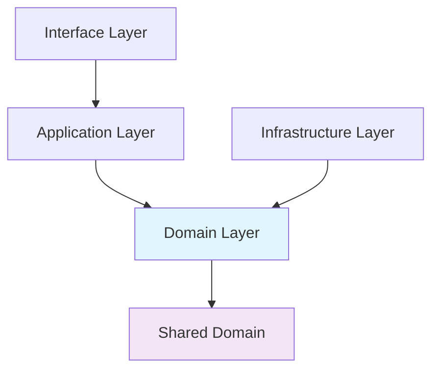

# Domain Development Guide

## Overview

This guide explains how to create new business domains in the FastAPI Enterprise application. Domains represent core business concepts and encapsulate related business logic, following Domain-Driven Design (DDD) principles within our hexagonal architecture.

## Understanding Domains

### What is a Domain?

A **domain** represents a specific area of business knowledge and activity. In our manufacturing pricing application, examples include:

- **Pricing Domain**: Handles pricing calculations, tiers, and strategies
- **Cost Domain**: Manages cost calculations and component pricing
- **Quote Domain**: Manages customer quotes and their lifecycle
- **Customer Domain**: Handles customer information and relationships
- **Inventory Domain**: Manages material availability and stock levels

### Domain Boundaries

Each domain should have:
- **Clear responsibility**: One primary business concern
- **Minimal coupling**: Limited dependencies on other domains
- **High cohesion**: Related concepts grouped together
- **Consistent language**: Uses business terminology throughout

## Domain Structure

### Standard Domain Organization

```
app/domains/{domain_name}/
├── __init__.py          # Domain package initialization
├── models.py            # Entities, value objects, and aggregates
├── services.py          # Domain services and business logic
├── repositories.py      # Repository interfaces (ports)
├── exceptions.py        # Domain-specific exceptions
└── events.py           # Domain events (optional)
```

### Domain Layer Dependencies



**Key Principles**:
- Domain layer depends only on other domains and shared concepts
- No dependencies on infrastructure, application, or interface layers
- Infrastructure layer implements domain interfaces

## Creating a New Domain: Inventory Management

Let's walk through creating a comprehensive **Inventory Domain** for managing material stock levels and availability.

### Step 1: Domain Analysis

**Business Requirements**:
- Track material inventory levels
- Handle stock reservations for quotes
- Manage supplier relationships
- Monitor low stock alerts
- Calculate material availability for pricing

**Core Concepts**:
- **Material**: Physical materials (aluminum, steel, etc.)
- **Stock Level**: Current quantity available
- **Reservation**: Temporary allocation for quotes
- **Supplier**: Material source and pricing
- **Replenishment**: Restocking process

### Step 2: Create Domain Structure

```bash
# Create the domain directory structure
mkdir -p app/domains/inventory
touch app/domains/inventory/__init__.py
touch app/domains/inventory/models.py
touch app/domains/inventory/services.py
touch app/domains/inventory/repositories.py
touch app/domains/inventory/exceptions.py
touch app/domains/inventory/events.py
```

### Step 3: Define Domain Models

**Value Objects** (`app/domains/inventory/models.py`):

```python
from dataclasses import dataclass
from decimal import Decimal
from enum import Enum
from typing import Optional, List, Dict
from datetime import datetime, timedelta
from uuid import UUID, uuid4

from app.domains.shared.value_objects import Money, Weight

@dataclass(frozen=True)
class MaterialCode:
    """Value object for material identification"""
    code: str
    description: str

    def __post_init__(self):
        if not self.code or len(self.code) < 3:
            raise ValueError("Material code must be at least 3 characters")
        if not self.description:
            raise ValueError("Material description is required")

@dataclass(frozen=True)
class StockQuantity:
    """Value object representing stock quantity with units"""
    amount: Decimal
    unit: str  # kg, pieces, meters, etc.

    def __post_init__(self):
        if self.amount < 0:
            raise ValueError("Stock quantity cannot be negative")
        if not self.unit:
            raise ValueError("Unit is required")

    def add(self, other: "StockQuantity") -> "StockQuantity":
        if self.unit != other.unit:
            raise ValueError(f"Cannot add different units: {self.unit} vs {other.unit}")
        return StockQuantity(self.amount + other.amount, self.unit)

    def subtract(self, other: "StockQuantity") -> "StockQuantity":
        if self.unit != other.unit:
            raise ValueError(f"Cannot subtract different units: {self.unit} vs {other.unit}")
        result = self.amount - other.amount
        if result < 0:
            raise ValueError("Insufficient stock quantity")
        return StockQuantity(result, self.unit)

    def is_sufficient_for(self, required: "StockQuantity") -> bool:
        if self.unit != required.unit:
            return False
        return self.amount >= required.amount

class ReservationStatus(Enum):
    ACTIVE = "active"
    EXPIRED = "expired"
    CONSUMED = "consumed"
    CANCELLED = "cancelled"

class SupplierRating(Enum):
    EXCELLENT = "excellent"
    GOOD = "good"
    FAIR = "fair"
    POOR = "poor"
```

**Entities and Aggregates**:

```python
class Material:
    """Material entity - represents a type of raw material"""

    def __init__(
        self,
        material_code: MaterialCode,
        category: str,
        properties: Dict[str, any],
        minimum_order_quantity: StockQuantity,
        lead_time_days: int
    ):
        self.id = uuid4()
        self.material_code = material_code
        self.category = category
        self.properties = properties
        self.minimum_order_quantity = minimum_order_quantity
        self.lead_time_days = lead_time_days
        self.created_at = datetime.utcnow()
        self.updated_at = datetime.utcnow()

    @property
    def code(self) -> str:
        return self.material_code.code

    @property
    def description(self) -> str:
        return self.material_code.description

    def update_properties(self, new_properties: Dict[str, any]) -> None:
        """Update material properties"""
        self.properties.update(new_properties)
        self.updated_at = datetime.utcnow()

class StockReservation:
    """Represents a temporary allocation of stock"""

    def __init__(
        self,
        material_id: UUID,
        quantity: StockQuantity,
        reserved_for: str,  # quote_id, order_id, etc.
        expires_at: datetime
    ):
        self.id = uuid4()
        self.material_id = material_id
        self.quantity = quantity
        self.reserved_for = reserved_for
        self.status = ReservationStatus.ACTIVE
        self.created_at = datetime.utcnow()
        self.expires_at = expires_at

    @property
    def is_expired(self) -> bool:
        return datetime.utcnow() > self.expires_at

    @property
    def is_active(self) -> bool:
        return self.status == ReservationStatus.ACTIVE and not self.is_expired

    def consume(self, consumed_quantity: StockQuantity) -> StockQuantity:
        """Mark reservation as consumed and return any unused quantity"""
        if not self.is_active:
            raise ValueError("Cannot consume inactive reservation")

        if consumed_quantity.amount > self.quantity.amount:
            raise ValueError("Cannot consume more than reserved quantity")

        self.status = ReservationStatus.CONSUMED
        remaining = self.quantity.subtract(consumed_quantity)
        return remaining

    def cancel(self) -> None:
        """Cancel the reservation"""
        if self.status == ReservationStatus.CONSUMED:
            raise ValueError("Cannot cancel consumed reservation")
        self.status = ReservationStatus.CANCELLED

    def extend_expiry(self, new_expiry: datetime) -> None:
        """Extend reservation expiry"""
        if not self.is_active:
            raise ValueError("Cannot extend inactive reservation")
        if new_expiry <= datetime.utcnow():
            raise ValueError("New expiry must be in the future")
        self.expires_at = new_expiry

class Supplier:
    """Supplier entity for material sourcing"""

    def __init__(
        self,
        name: str,
        contact_info: Dict[str, str],
        rating: SupplierRating = SupplierRating.GOOD
    ):
        self.id = uuid4()
        self.name = name
        self.contact_info = contact_info
        self.rating = rating
        self.is_active = True
        self.created_at = datetime.utcnow()
        self.updated_at = datetime.utcnow()

    def update_rating(self, new_rating: SupplierRating) -> None:
        """Update supplier rating"""
        self.rating = new_rating
        self.updated_at = datetime.utcnow()

    def deactivate(self) -> None:
        """Deactivate supplier"""
        self.is_active = False
        self.updated_at = datetime.utcnow()

class MaterialStock:
    """Aggregate root for material inventory management"""

    def __init__(
        self,
        material: Material,
        current_quantity: StockQuantity,
        reorder_level: StockQuantity,
        max_level: StockQuantity
    ):
        self.id = uuid4()
        self.material = material
        self.current_quantity = current_quantity
        self.reorder_level = reorder_level
        self.max_level = max_level
        self.last_updated = datetime.utcnow()

        # Track reservations
        self._reservations: List[StockReservation] = []

        # Track stock movements
        self._movements: List[StockMovement] = []

    @property
    def available_quantity(self) -> StockQuantity:
        """Calculate available quantity (current - active reservations)"""
        reserved_amount = sum(
            res.quantity.amount for res in self._reservations
            if res.is_active
        )

        available_amount = self.current_quantity.amount - reserved_amount
        return StockQuantity(max(Decimal('0'), available_amount), self.current_quantity.unit)

    @property
    def is_low_stock(self) -> bool:
        """Check if stock is below reorder level"""
        return self.current_quantity.amount <= self.reorder_level.amount

    @property
    def needs_replenishment(self) -> bool:
        """Check if stock needs replenishment considering reservations"""
        return self.available_quantity.amount <= self.reorder_level.amount

    def reserve_stock(
        self,
        quantity: StockQuantity,
        reserved_for: str,
        duration_hours: int = 24
    ) -> StockReservation:
        """Reserve stock for a specific purpose"""
        if not self.can_reserve(quantity):
            raise InsufficientStockError(
                f"Cannot reserve {quantity.amount} {quantity.unit}. "
                f"Available: {self.available_quantity.amount} {self.available_quantity.unit}"
            )

        expires_at = datetime.utcnow() + timedelta(hours=duration_hours)
        reservation = StockReservation(
            material_id=self.material.id,
            quantity=quantity,
            reserved_for=reserved_for,
            expires_at=expires_at
        )

        self._reservations.append(reservation)
        return reservation

    def can_reserve(self, quantity: StockQuantity) -> bool:
        """Check if the requested quantity can be reserved"""
        return self.available_quantity.is_sufficient_for(quantity)

    def add_stock(self, quantity: StockQuantity, reason: str, supplier_id: Optional[UUID] = None) -> None:
        """Add stock (from receiving, returns, etc.)"""
        if quantity.unit != self.current_quantity.unit:
            raise ValueError(f"Unit mismatch: {quantity.unit} vs {self.current_quantity.unit}")

        self.current_quantity = self.current_quantity.add(quantity)
        self.last_updated = datetime.utcnow()

        # Record movement
        movement = StockMovement(
            material_id=self.material.id,
            movement_type=StockMovementType.INBOUND,
            quantity=quantity,
            reason=reason,
            supplier_id=supplier_id
        )
        self._movements.append(movement)

    def consume_stock(self, quantity: StockQuantity, reason: str, reservation_id: Optional[UUID] = None) -> None:
        """Consume stock for production/orders"""
        if not self.current_quantity.is_sufficient_for(quantity):
            raise InsufficientStockError(
                f"Cannot consume {quantity.amount} {quantity.unit}. "
                f"Available: {self.current_quantity.amount} {self.current_quantity.unit}"
            )

        # If consuming from a reservation, handle it
        if reservation_id:
            reservation = self._find_reservation(reservation_id)
            if reservation and reservation.is_active:
                remaining = reservation.consume(quantity)
                # Return any unused quantity to general stock

        self.current_quantity = self.current_quantity.subtract(quantity)
        self.last_updated = datetime.utcnow()

        # Record movement
        movement = StockMovement(
            material_id=self.material.id,
            movement_type=StockMovementType.OUTBOUND,
            quantity=quantity,
            reason=reason,
            reservation_id=reservation_id
        )
        self._movements.append(movement)

    def expire_old_reservations(self) -> List[StockReservation]:
        """Expire old reservations and return them"""
        expired = []
        for reservation in self._reservations:
            if reservation.is_expired and reservation.status == ReservationStatus.ACTIVE:
                reservation.status = ReservationStatus.EXPIRED
                expired.append(reservation)

        return expired

    def _find_reservation(self, reservation_id: UUID) -> Optional[StockReservation]:
        """Find reservation by ID"""
        return next(
            (res for res in self._reservations if res.id == reservation_id),
            None
        )

class StockMovementType(Enum):
    INBOUND = "inbound"      # Receiving, returns
    OUTBOUND = "outbound"    # Production, sales, waste
    ADJUSTMENT = "adjustment" # Inventory corrections
    TRANSFER = "transfer"    # Location transfers

@dataclass
class StockMovement:
    """Value object representing a stock movement"""
    material_id: UUID
    movement_type: StockMovementType
    quantity: StockQuantity
    reason: str
    timestamp: datetime = None
    supplier_id: Optional[UUID] = None
    reservation_id: Optional[UUID] = None

    def __post_init__(self):
        if self.timestamp is None:
            self.timestamp = datetime.utcnow()
```

### Step 4: Define Domain Exceptions

**Domain-specific exceptions** (`app/domains/inventory/exceptions.py`):

```python
class InventoryError(Exception):
    """Base exception for inventory-related errors"""
    pass

class MaterialNotFoundError(InventoryError):
    """Raised when a material cannot be found"""
    pass

class InsufficientStockError(InventoryError):
    """Raised when there's insufficient stock for an operation"""
    pass

class InvalidReservationError(InventoryError):
    """Raised when reservation operation is invalid"""
    pass

class SupplierNotFoundError(InventoryError):
    """Raised when a supplier cannot be found"""
    pass

class InvalidStockOperationError(InventoryError):
    """Raised when attempting invalid stock operations"""
    pass

class StockLevelError(InventoryError):
    """Raised when stock levels are invalid"""
    pass
```

### Step 5: Create Repository Interfaces

**Repository interfaces** (`app/domains/inventory/repositories.py`):

```python
from abc import ABC, abstractmethod
from typing import List, Optional, Dict
from uuid import UUID
from datetime import datetime

from app.domains.inventory.models import (
    Material, MaterialStock, Supplier, StockReservation,
    StockMovement, StockQuantity
)

class MaterialRepository(ABC):
    """Repository for material management"""

    @abstractmethod
    async def save(self, material: Material) -> None:
        """Save or update a material"""
        pass

    @abstractmethod
    async def find_by_id(self, material_id: UUID) -> Optional[Material]:
        """Find material by ID"""
        pass

    @abstractmethod
    async def find_by_code(self, code: str) -> Optional[Material]:
        """Find material by code"""
        pass

    @abstractmethod
    async def find_by_category(self, category: str) -> List[Material]:
        """Find materials by category"""
        pass

    @abstractmethod
    async def find_all_active(self) -> List[Material]:
        """Find all active materials"""
        pass

class MaterialStockRepository(ABC):
    """Repository for material stock management"""

    @abstractmethod
    async def save(self, stock: MaterialStock) -> None:
        """Save or update material stock"""
        pass

    @abstractmethod
    async def find_by_material_id(self, material_id: UUID) -> Optional[MaterialStock]:
        """Find stock by material ID"""
        pass

    @abstractmethod
    async def find_low_stock_items(self) -> List[MaterialStock]:
        """Find items with low stock levels"""
        pass

    @abstractmethod
    async def find_by_availability(self, min_quantity: StockQuantity) -> List[MaterialStock]:
        """Find materials with minimum available quantity"""
        pass

class ReservationRepository(ABC):
    """Repository for stock reservations"""

    @abstractmethod
    async def save(self, reservation: StockReservation) -> None:
        """Save or update a reservation"""
        pass

    @abstractmethod
    async def find_by_id(self, reservation_id: UUID) -> Optional[StockReservation]:
        """Find reservation by ID"""
        pass

    @abstractmethod
    async def find_by_material(self, material_id: UUID) -> List[StockReservation]:
        """Find reservations for a material"""
        pass

    @abstractmethod
    async def find_expired_reservations(self) -> List[StockReservation]:
        """Find all expired reservations"""
        pass

    @abstractmethod
    async def find_by_owner(self, reserved_for: str) -> List[StockReservation]:
        """Find reservations by owner (quote_id, order_id, etc.)"""
        pass

class SupplierRepository(ABC):
    """Repository for supplier management"""

    @abstractmethod
    async def save(self, supplier: Supplier) -> None:
        """Save or update a supplier"""
        pass

    @abstractmethod
    async def find_by_id(self, supplier_id: UUID) -> Optional[Supplier]:
        """Find supplier by ID"""
        pass

    @abstractmethod
    async def find_active_suppliers(self) -> List[Supplier]:
        """Find all active suppliers"""
        pass

    @abstractmethod
    async def find_by_material(self, material_id: UUID) -> List[Supplier]:
        """Find suppliers for a specific material"""
        pass
```

### Step 6: Implement Domain Services

**Domain services** (`app/domains/inventory/services.py`):

```python
from typing import List, Optional, Dict
from uuid import UUID
from datetime import datetime, timedelta
from decimal import Decimal

from app.domains.inventory.models import (
    Material, MaterialStock, Supplier, StockReservation,
    StockQuantity, MaterialCode, SupplierRating
)
from app.domains.inventory.repositories import (
    MaterialRepository, MaterialStockRepository,
    ReservationRepository, SupplierRepository
)
from app.domains.inventory.exceptions import (
    MaterialNotFoundError, InsufficientStockError,
    InvalidReservationError, SupplierNotFoundError
)

class InventoryService:
    """Domain service for inventory management operations"""

    def __init__(
        self,
        material_repo: MaterialRepository,
        stock_repo: MaterialStockRepository,
        reservation_repo: ReservationRepository,
        supplier_repo: SupplierRepository
    ):
        self._material_repo = material_repo
        self._stock_repo = stock_repo
        self._reservation_repo = reservation_repo
        self._supplier_repo = supplier_repo

    async def check_material_availability(
        self,
        material_code: str,
        required_quantity: StockQuantity
    ) -> bool:
        """Check if material is available in required quantity"""
        material = await self._material_repo.find_by_code(material_code)
        if not material:
            raise MaterialNotFoundError(f"Material '{material_code}' not found")

        stock = await self._stock_repo.find_by_material_id(material.id)
        if not stock:
            return False

        return stock.can_reserve(required_quantity)

    async def reserve_materials(
        self,
        material_requirements: Dict[str, StockQuantity],
        reserved_for: str,
        duration_hours: int = 24
    ) -> List[StockReservation]:
        """Reserve multiple materials for a specific purpose"""
        reservations = []

        try:
            for material_code, quantity in material_requirements.items():
                # Check availability first
                if not await self.check_material_availability(material_code, quantity):
                    raise InsufficientStockError(
                        f"Insufficient stock for material '{material_code}'"
                    )

                # Create reservation
                material = await self._material_repo.find_by_code(material_code)
                stock = await self._stock_repo.find_by_material_id(material.id)

                reservation = stock.reserve_stock(quantity, reserved_for, duration_hours)
                await self._reservation_repo.save(reservation)
                await self._stock_repo.save(stock)

                reservations.append(reservation)

            return reservations

        except Exception as e:
            # Rollback any successful reservations
            for reservation in reservations:
                reservation.cancel()
                await self._reservation_repo.save(reservation)
            raise

    async def calculate_material_cost(
        self,
        material_code: str,
        quantity: StockQuantity
    ) -> Decimal:
        """Calculate total cost for material quantity"""
        material = await self._material_repo.find_by_code(material_code)
        if not material:
            raise MaterialNotFoundError(f"Material '{material_code}' not found")

        # Get best supplier price
        suppliers = await self._supplier_repo.find_by_material(material.id)
        if not suppliers:
            raise SupplierNotFoundError(f"No suppliers found for material '{material_code}'")

        # For simplicity, use the first active supplier
        # In reality, you'd have a more complex pricing strategy
        active_suppliers = [s for s in suppliers if s.is_active]
        if not active_suppliers:
            raise SupplierNotFoundError(f"No active suppliers for material '{material_code}'")

        # Get material cost from supplier pricing
        # This would typically involve external pricing APIs or database lookups
        base_cost_per_unit = await self._get_supplier_price(active_suppliers[0].id, material.id)

        return base_cost_per_unit * quantity.amount

    async def get_low_stock_report(self) -> List[Dict]:
        """Generate report of materials with low stock"""
        low_stock_items = await self._stock_repo.find_low_stock_items()

        report = []
        for stock in low_stock_items:
            material = await self._material_repo.find_by_id(stock.material.id)
            suppliers = await self._supplier_repo.find_by_material(material.id)

            report.append({
                "material_code": material.code,
                "description": material.description,
                "current_quantity": stock.current_quantity,
                "available_quantity": stock.available_quantity,
                "reorder_level": stock.reorder_level,
                "suppliers": [s.name for s in suppliers if s.is_active],
                "lead_time_days": material.lead_time_days
            })

        return report

    async def expire_old_reservations(self) -> int:
        """Clean up expired reservations"""
        expired_reservations = await self._reservation_repo.find_expired_reservations()

        count = 0
        for reservation in expired_reservations:
            if reservation.is_expired and reservation.status.value == "active":
                reservation.status = reservation.status.EXPIRED
                await self._reservation_repo.save(reservation)
                count += 1

        return count

    async def create_replenishment_order(
        self,
        material_id: UUID,
        supplier_id: UUID,
        quantity: StockQuantity
    ) -> Dict:
        """Create a replenishment order (simplified)"""
        material = await self._material_repo.find_by_id(material_id)
        if not material:
            raise MaterialNotFoundError(f"Material '{material_id}' not found")

        supplier = await self._supplier_repo.find_by_id(supplier_id)
        if not supplier:
            raise SupplierNotFoundError(f"Supplier '{supplier_id}' not found")

        # In a real system, this would integrate with procurement systems
        order = {
            "material": material.code,
            "supplier": supplier.name,
            "quantity": quantity,
            "estimated_cost": await self._get_supplier_price(supplier_id, material_id) * quantity.amount,
            "expected_delivery": datetime.utcnow() + timedelta(days=material.lead_time_days),
            "order_date": datetime.utcnow()
        }

        return order

    async def _get_supplier_price(self, supplier_id: UUID, material_id: UUID) -> Decimal:
        """Get current price from supplier for material"""
        # This would typically integrate with supplier pricing APIs
        # For now, return a placeholder
        return Decimal("10.50")  # $10.50 per unit

class StockMovementService:
    """Service for tracking stock movements and history"""

    def __init__(self, stock_repo: MaterialStockRepository):
        self._stock_repo = stock_repo

    async def record_receipt(
        self,
        material_id: UUID,
        quantity: StockQuantity,
        supplier_id: UUID,
        batch_number: Optional[str] = None
    ) -> None:
        """Record material receipt from supplier"""
        stock = await self._stock_repo.find_by_material_id(material_id)
        if not stock:
            raise MaterialNotFoundError(f"Stock record not found for material '{material_id}'")

        reason = f"Receipt from supplier"
        if batch_number:
            reason += f" (Batch: {batch_number})"

        stock.add_stock(quantity, reason, supplier_id)
        await self._stock_repo.save(stock)

    async def record_consumption(
        self,
        material_id: UUID,
        quantity: StockQuantity,
        order_id: str,
        reservation_id: Optional[UUID] = None
    ) -> None:
        """Record material consumption for production"""
        stock = await self._stock_repo.find_by_material_id(material_id)
        if not stock:
            raise MaterialNotFoundError(f"Stock record not found for material '{material_id}'")

        reason = f"Consumed for order {order_id}"
        stock.consume_stock(quantity, reason, reservation_id)
        await self._stock_repo.save(stock)

    async def adjust_stock(
        self,
        material_id: UUID,
        adjustment_quantity: StockQuantity,
        reason: str
    ) -> None:
        """Adjust stock levels (cycle count corrections, etc.)"""
        stock = await self._stock_repo.find_by_material_id(material_id)
        if not stock:
            raise MaterialNotFoundError(f"Stock record not found for material '{material_id}'")

        if adjustment_quantity.amount >= 0:
            stock.add_stock(adjustment_quantity, f"Adjustment: {reason}")
        else:
            # Negative adjustment
            positive_quantity = StockQuantity(-adjustment_quantity.amount, adjustment_quantity.unit)
            stock.consume_stock(positive_quantity, f"Adjustment: {reason}")

        await self._stock_repo.save(stock)
```

### Step 7: Define Domain Events

**Domain events** (`app/domains/inventory/events.py`):

```python
from dataclasses import dataclass
from datetime import datetime
from uuid import UUID
from typing import Dict, Any

from app.domains.inventory.models import StockQuantity

@dataclass
class DomainEvent:
    """Base class for domain events"""
    event_id: UUID
    occurred_at: datetime
    event_type: str

@dataclass
class MaterialStockReserved(DomainEvent):
    """Event raised when stock is reserved"""
    material_id: UUID
    quantity: StockQuantity
    reserved_for: str
    reservation_id: UUID

@dataclass
class MaterialStockConsumed(DomainEvent):
    """Event raised when stock is consumed"""
    material_id: UUID
    quantity: StockQuantity
    reason: str
    remaining_stock: StockQuantity

@dataclass
class LowStockAlert(DomainEvent):
    """Event raised when stock falls below reorder level"""
    material_id: UUID
    current_quantity: StockQuantity
    reorder_level: StockQuantity
    available_quantity: StockQuantity

@dataclass
class MaterialReceived(DomainEvent):
    """Event raised when material is received from supplier"""
    material_id: UUID
    quantity: StockQuantity
    supplier_id: UUID
    batch_number: str

@dataclass
class ReservationExpired(DomainEvent):
    """Event raised when a reservation expires"""
    reservation_id: UUID
    material_id: UUID
    quantity: StockQuantity
    reserved_for: str
```

### Step 8: Create Tests

**Unit tests** (`tests/unit/domains/test_inventory/test_models.py`):

```python
import pytest
from decimal import Decimal
from datetime import datetime, timedelta
from uuid import uuid4

from app.domains.inventory.models import (
    Material, MaterialStock, StockQuantity, MaterialCode,
    StockReservation, ReservationStatus
)
from app.domains.inventory.exceptions import (
    InsufficientStockError, InvalidStockOperationError
)

class TestStockQuantity:
    def test_create_stock_quantity(self):
        """Test stock quantity creation"""
        quantity = StockQuantity(Decimal("100.5"), "kg")

        assert quantity.amount == Decimal("100.5")
        assert quantity.unit == "kg"

    def test_cannot_create_negative_quantity(self):
        """Test that negative quantities are rejected"""
        with pytest.raises(ValueError):
            StockQuantity(Decimal("-10"), "kg")

    def test_add_quantities(self):
        """Test adding quantities"""
        qty1 = StockQuantity(Decimal("100"), "kg")
        qty2 = StockQuantity(Decimal("50"), "kg")

        result = qty1.add(qty2)

        assert result.amount == Decimal("150")
        assert result.unit == "kg"

    def test_cannot_add_different_units(self):
        """Test that different units cannot be added"""
        qty1 = StockQuantity(Decimal("100"), "kg")
        qty2 = StockQuantity(Decimal("50"), "pieces")

        with pytest.raises(ValueError):
            qty1.add(qty2)

class TestMaterialStock:
    def test_create_material_stock(self):
        """Test material stock creation"""
        material = create_test_material()
        current_qty = StockQuantity(Decimal("1000"), "kg")
        reorder_level = StockQuantity(Decimal("100"), "kg")
        max_level = StockQuantity(Decimal("2000"), "kg")

        stock = MaterialStock(material, current_qty, reorder_level, max_level)

        assert stock.material == material
        assert stock.current_quantity == current_qty
        assert stock.available_quantity == current_qty

    def test_reserve_stock(self):
        """Test stock reservation"""
        stock = create_test_stock()
        reserve_qty = StockQuantity(Decimal("100"), "kg")

        reservation = stock.reserve_stock(reserve_qty, "quote_123")

        assert reservation.quantity == reserve_qty
        assert reservation.reserved_for == "quote_123"
        assert reservation.is_active
        assert stock.available_quantity.amount == Decimal("900")  # 1000 - 100

    def test_cannot_reserve_insufficient_stock(self):
        """Test that insufficient stock cannot be reserved"""
        stock = create_test_stock()
        reserve_qty = StockQuantity(Decimal("1500"), "kg")  # More than available

        with pytest.raises(InsufficientStockError):
            stock.reserve_stock(reserve_qty, "quote_123")

    def test_consume_stock(self):
        """Test stock consumption"""
        stock = create_test_stock()
        consume_qty = StockQuantity(Decimal("200"), "kg")

        stock.consume_stock(consume_qty, "order_456")

        assert stock.current_quantity.amount == Decimal("800")  # 1000 - 200

    def test_low_stock_detection(self):
        """Test low stock detection"""
        material = create_test_material()
        current_qty = StockQuantity(Decimal("50"), "kg")  # Below reorder level
        reorder_level = StockQuantity(Decimal("100"), "kg")
        max_level = StockQuantity(Decimal("2000"), "kg")

        stock = MaterialStock(material, current_qty, reorder_level, max_level)

        assert stock.is_low_stock

class TestStockReservation:
    def test_create_reservation(self):
        """Test reservation creation"""
        material_id = uuid4()
        quantity = StockQuantity(Decimal("100"), "kg")
        expires_at = datetime.utcnow() + timedelta(hours=24)

        reservation = StockReservation(material_id, quantity, "quote_123", expires_at)

        assert reservation.material_id == material_id
        assert reservation.quantity == quantity
        assert reservation.reserved_for == "quote_123"
        assert reservation.status == ReservationStatus.ACTIVE
        assert not reservation.is_expired

    def test_consume_reservation(self):
        """Test consuming a reservation"""
        reservation = create_test_reservation()
        consume_qty = StockQuantity(Decimal("50"), "kg")

        remaining = reservation.consume(consume_qty)

        assert reservation.status == ReservationStatus.CONSUMED
        assert remaining.amount == Decimal("50")  # 100 - 50

    def test_cancel_reservation(self):
        """Test canceling a reservation"""
        reservation = create_test_reservation()

        reservation.cancel()

        assert reservation.status == ReservationStatus.CANCELLED

    def test_extend_reservation(self):
        """Test extending reservation expiry"""
        reservation = create_test_reservation()
        new_expiry = datetime.utcnow() + timedelta(hours=48)

        reservation.extend_expiry(new_expiry)

        assert reservation.expires_at == new_expiry

def create_test_material() -> Material:
    """Helper to create test material"""
    material_code = MaterialCode("ALU6061", "Aluminum 6061 Alloy")
    return Material(
        material_code=material_code,
        category="metals",
        properties={"density": 2.70, "strength": "medium"},
        minimum_order_quantity=StockQuantity(Decimal("50"), "kg"),
        lead_time_days=7
    )

def create_test_stock() -> MaterialStock:
    """Helper to create test stock"""
    material = create_test_material()
    current_qty = StockQuantity(Decimal("1000"), "kg")
    reorder_level = StockQuantity(Decimal("100"), "kg")
    max_level = StockQuantity(Decimal("2000"), "kg")

    return MaterialStock(material, current_qty, reorder_level, max_level)

def create_test_reservation() -> StockReservation:
    """Helper to create test reservation"""
    material_id = uuid4()
    quantity = StockQuantity(Decimal("100"), "kg")
    expires_at = datetime.utcnow() + timedelta(hours=24)

    return StockReservation(material_id, quantity, "quote_123", expires_at)
```

### Step 9: Integration with Other Domains

**Integrate with Pricing Domain** (`app/domains/pricing/services.py` - update existing):

```python
# Add to existing PricingService class
from app.domains.inventory.services import InventoryService
from app.domains.inventory.exceptions import InsufficientStockError

class PricingService:
    def __init__(
        self,
        cost_service: CostService,
        inventory_service: InventoryService,  # Add this
        repository: PricingRepository
    ):
        self._cost_service = cost_service
        self._inventory_service = inventory_service  # Add this
        self._repository = repository

    async def calculate_pricing_with_availability(
        self,
        specification: PartSpecification
    ) -> PricingResult:
        """Calculate pricing with material availability check"""
        # Check material availability first
        required_quantity = self._calculate_material_requirements(specification)

        is_available = await self._inventory_service.check_material_availability(
            specification.material,
            required_quantity
        )

        if not is_available:
            raise InsufficientStockError(
                f"Insufficient stock for material '{specification.material}'"
            )

        # Get actual material cost from inventory
        material_cost = await self._inventory_service.calculate_material_cost(
            specification.material,
            required_quantity
        )

        # Continue with normal pricing calculation using actual cost
        return await self._calculate_pricing_with_cost(specification, material_cost)
```

## Domain Integration Patterns

### 1. Domain Service Coordination

When domains need to interact, use domain services:

```python
class OrderFulfillmentService:
    """Coordinates between multiple domains"""

    def __init__(
        self,
        inventory_service: InventoryService,
        pricing_service: PricingService,
        quote_service: QuoteService
    ):
        self._inventory = inventory_service
        self._pricing = pricing_service
        self._quotes = quote_service

    async def process_quote_acceptance(self, quote_id: UUID) -> OrderResult:
        """Process quote acceptance across domains"""
        # 1. Get quote details
        quote = await self._quotes.get_quote(quote_id)

        # 2. Reserve materials
        material_requirements = self._extract_material_requirements(quote)
        reservations = await self._inventory.reserve_materials(
            material_requirements,
            f"order_{quote.id}"
        )

        # 3. Create order
        order = Order.from_quote(quote, reservations)

        return OrderResult(order, reservations)
```

### 2. Event-Driven Communication

Use domain events for loose coupling:

```python
# Event publisher/subscriber pattern
class DomainEventPublisher:
    def __init__(self):
        self._handlers = {}

    def subscribe(self, event_type: Type, handler: Callable):
        if event_type not in self._handlers:
            self._handlers[event_type] = []
        self._handlers[event_type].append(handler)

    async def publish(self, event: DomainEvent):
        event_type = type(event)
        if event_type in self._handlers:
            for handler in self._handlers[event_type]:
                await handler(event)

# Event handler in pricing domain
class PricingEventHandler:
    def __init__(self, pricing_service: PricingService):
        self._pricing_service = pricing_service

    async def handle_low_stock_alert(self, event: LowStockAlert):
        """Adjust pricing when stock is low"""
        # Increase pricing for materials with low stock
        await self._pricing_service.apply_scarcity_premium(event.material_id)
```

## Best Practices for Domain Development

### 1. Domain Purity
- Keep domain models free of infrastructure concerns
- Use dependency injection for external services
- Avoid anemic domain models (models without behavior)

### 2. Ubiquitous Language
- Use business terminology consistently
- Avoid technical jargon in domain models
- Align code with business concepts

### 3. Testing Strategy
- Test domain logic in isolation
- Use test builders for complex domain objects
- Mock external dependencies in unit tests

### 4. Performance Considerations
- Use lazy loading for expensive operations
- Implement caching at the service level
- Consider read models for complex queries

### 5. Evolution and Refactoring
- Design for change with clear interfaces
- Use feature flags for gradual rollouts
- Maintain backward compatibility in APIs

This comprehensive approach to domain development ensures that business logic remains central, testable, and maintainable while integrating seamlessly with the overall hexagonal architecture.
