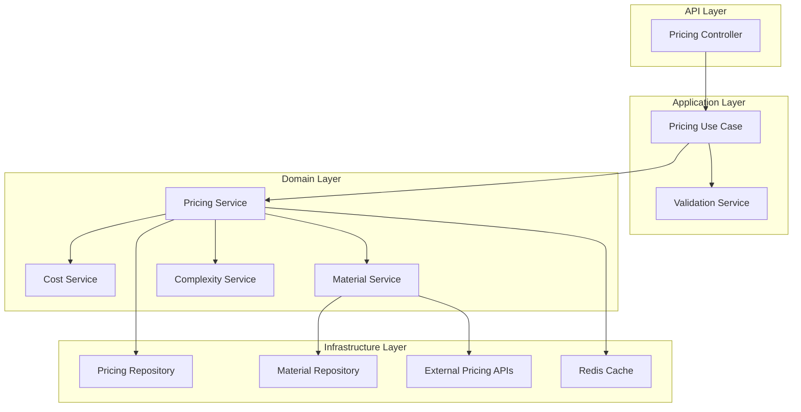

# Pricing System

## Overview

The pricing system is the core business feature of the FastAPI Enterprise application, providing comprehensive manufacturing cost calculation and pricing strategies for custom parts. It implements sophisticated algorithms for material costs, labor calculations, complexity adjustments, and tiered pricing models.

## Business Requirements

### Core Functionality

- **Part Specification Processing**: Handle detailed part specifications including materials, dimensions, processes, and requirements
- **Multi-Factor Pricing**: Calculate costs based on materials, labor, setup, complexity, and overhead
- **Tiered Pricing Strategy**: Provide multiple pricing tiers (expedited, standard, economy, domestic economy)
- **Volume Discounts**: Apply discounts based on quantity and customer tier
- **Real-time Calculations**: Provide fast, accurate pricing calculations for customer quotes

### Key Business Rules

1. **Minimum Order Quantities**: Enforce minimum quantities per material/process combination
2. **Complexity Scoring**: Use geometric complexity scores (1.0-5.0) to adjust pricing
3. **Customer Tiers**: Apply different margins and discounts based on customer classification
4. **Rush Order Premiums**: Add surcharges for expedited delivery timelines
5. **Special Requirements**: Handle custom requirements with appropriate cost adjustments

## Architecture Overview

### Domain Model

```mermaid
classDiagram
    class PartSpecification {
        +Material material
        +int quantity
        +Dimensions dimensions
        +float geometric_complexity_score
        +Process process
        +SurfaceFinish surface_finish
        +ToleranceClass tolerance_class
        +List~string~ special_requirements
        +DeliveryTimeline delivery_timeline
        +bool rush_order
        +CustomerTier customer_tier
    }

    class PricingCalculation {
        +UUID id
        +PartSpecification specification
        +CostBreakdown cost_breakdown
        +Map~string,PricingTier~ pricing_tiers
        +Weight estimated_weight
        +datetime created_at
        +calculate_volume() float
        +get_best_price() Money
    }

    class CostBreakdown {
        +Money material_cost
        +Money labor_cost
        +Money setup_cost
        +Money complexity_adjustment
        +Money overhead_cost
        +Money total_cost
        +get_cost_per_unit() Money
    }

    class PricingTier {
        +Money base_cost
        +float margin
        +Money shipping_cost
        +float volume_discount
        +Money complexity_surcharge
        +Money subtotal
        +float final_discount
        +Money final_price
        +Money price_per_unit
    }

    PartSpecification ||--|| PricingCalculation
    PricingCalculation ||--|| CostBreakdown
    PricingCalculation ||--o{ PricingTier
```

### Service Architecture



## Implementation Details

### Core Domain Models

**Part Specification** (`app/domains/pricing/models.py`):

```python
from dataclasses import dataclass
from decimal import Decimal
from enum import Enum
from typing import List, Optional
from uuid import UUID

from app.domains.shared.value_objects import Money, Dimensions

class Material(Enum):
    ALUMINUM = "aluminum"
    STEEL = "steel"
    STAINLESS_STEEL = "stainless_steel"
    BRASS = "brass"
    COPPER = "copper"
    TITANIUM = "titanium"
    PLASTIC_ABS = "plastic_abs"
    PLASTIC_PLA = "plastic_pla"

class Process(Enum):
    CNC = "cnc"
    THREE_D_PRINTING = "3d_printing"
    INJECTION_MOLDING = "injection_molding"
    SHEET_METAL = "sheet_metal"
    CASTING = "casting"
    FORGING = "forging"

class SurfaceFinish(Enum):
    STANDARD = "standard"
    POLISHED = "polished"
    ANODIZED = "anodized"
    POWDER_COATED = "powder_coated"
    PLATED = "plated"

class ToleranceClass(Enum):
    STANDARD = "standard"
    PRECISION = "precision"
    HIGH_PRECISION = "high_precision"

class DeliveryTimeline(Enum):
    STANDARD = "standard"  # 2-3 weeks
    EXPEDITED = "expedited"  # 1-2 weeks
    RUSH = "rush"  # 3-5 days

class CustomerTier(Enum):
    STANDARD = "standard"
    PREMIUM = "premium"
    ENTERPRISE = "enterprise"

@dataclass(frozen=True)
class PartSpecification:
    """Complete specification for a manufacturing part"""
    material: Material
    quantity: int
    dimensions: Dimensions
    geometric_complexity_score: float
    process: Process
    surface_finish: Optional[SurfaceFinish] = SurfaceFinish.STANDARD
    tolerance_class: Optional[ToleranceClass] = ToleranceClass.STANDARD
    special_requirements: List[str] = None
    delivery_timeline: Optional[DeliveryTimeline] = DeliveryTimeline.STANDARD
    rush_order: bool = False
    customer_tier: Optional[CustomerTier] = CustomerTier.STANDARD

    def __post_init__(self):
        if self.quantity <= 0:
            raise ValueError("Quantity must be positive")
        if not (1.0 <= self.geometric_complexity_score <= 5.0):
            raise ValueError("Complexity score must be between 1.0 and 5.0")
        if self.special_requirements is None:
            object.__setattr__(self, 'special_requirements', [])

    @property
    def volume_cm3(self) -> float:
        """Calculate part volume in cubic centimeters"""
        return self.dimensions.volume_cm3()

    @property
    def is_high_complexity(self) -> bool:
        """Check if part has high geometric complexity"""
        return self.geometric_complexity_score >= 4.0

    @property
    def requires_special_handling(self) -> bool:
        """Check if part requires special handling"""
        return (
            self.is_high_complexity or
            self.tolerance_class in [ToleranceClass.PRECISION, ToleranceClass.HIGH_PRECISION] or
            len(self.special_requirements) > 0 or
            self.rush_order
        )
```

**Cost Breakdown** (`app/domains/pricing/models.py`):

```python
@dataclass(frozen=True)
class CostBreakdown:
    """Detailed breakdown of manufacturing costs"""
    material_cost: Money
    labor_cost: Money
    setup_cost: Money
    complexity_adjustment: Money
    overhead_cost: Money

    @property
    def total_cost(self) -> Money:
        """Calculate total manufacturing cost"""
        return (
            self.material_cost +
            self.labor_cost +
            self.setup_cost +
            self.complexity_adjustment +
            self.overhead_cost
        )

    def get_cost_per_unit(self, quantity: int) -> Money:
        """Calculate cost per unit for given quantity"""
        if quantity <= 0:
            raise ValueError("Quantity must be positive")

        # Setup cost is amortized across quantity
        per_unit_setup = Money(self.setup_cost.amount / quantity, self.setup_cost.currency)

        return (
            self.material_cost +
            self.labor_cost +
            per_unit_setup +
            self.complexity_adjustment +
            self.overhead_cost
        )

    def get_cost_percentage_breakdown(self) -> dict:
        """Get cost breakdown as percentages"""
        total = self.total_cost.amount
        if total == 0:
            return {}

        return {
            "material": float((self.material_cost.amount / total) * 100),
            "labor": float((self.labor_cost.amount / total) * 100),
            "setup": float((self.setup_cost.amount / total) * 100),
            "complexity": float((self.complexity_adjustment.amount / total) * 100),
            "overhead": float((self.overhead_cost.amount / total) * 100)
        }
```

**Pricing Tiers** (`app/domains/pricing/models.py`):

```python
@dataclass(frozen=True)
class PricingTier:
    """Represents a pricing tier with margins and adjustments"""
    tier_name: str
    base_cost: Money
    margin_percentage: float
    shipping_cost: Money
    volume_discount_percentage: float = 0.0
    complexity_surcharge: Money = None
    special_handling_fee: Money = None

    def __post_init__(self):
        if self.complexity_surcharge is None:
            object.__setattr__(self, 'complexity_surcharge', Money(0, self.base_cost.currency))
        if self.special_handling_fee is None:
            object.__setattr__(self, 'special_handling_fee', Money(0, self.base_cost.currency))

    @property
    def subtotal(self) -> Money:
        """Calculate subtotal before final adjustments"""
        margin_amount = self.base_cost * (self.margin_percentage / 100)
        return (
            self.base_cost +
            margin_amount +
            self.shipping_cost +
            self.complexity_surcharge +
            self.special_handling_fee
        )

    @property
    def volume_discount_amount(self) -> Money:
        """Calculate volume discount amount"""
        return self.subtotal * (self.volume_discount_percentage / 100)

    @property
    def final_price(self) -> Money:
        """Calculate final price after all adjustments"""
        return self.subtotal - self.volume_discount_amount

    def calculate_price_per_unit(self, quantity: int) -> Money:
        """Calculate price per unit for given quantity"""
        if quantity <= 0:
            raise ValueError("Quantity must be positive")

        return Money(
            self.final_price.amount / quantity,
            self.final_price.currency
        )

class PricingResult:
    """Complete pricing calculation result"""

    def __init__(
        self,
        specification: PartSpecification,
        cost_breakdown: CostBreakdown,
        pricing_tiers: dict[str, PricingTier],
        estimated_weight_kg: float
    ):
        self.id = uuid4()
        self.specification = specification
        self.cost_breakdown = cost_breakdown
        self.pricing_tiers = pricing_tiers
        self.estimated_weight_kg = estimated_weight_kg
        self.created_at = datetime.utcnow()

    @property
    def quantity(self) -> int:
        return self.specification.quantity

    @property
    def best_price_tier(self) -> str:
        """Get the tier with the lowest price"""
        if not self.pricing_tiers:
            raise ValueError("No pricing tiers available")

        return min(
            self.pricing_tiers.keys(),
            key=lambda tier: self.pricing_tiers[tier].final_price.amount
        )

    @property
    def best_price(self) -> Money:
        """Get the best (lowest) price across all tiers"""
        best_tier = self.best_price_tier
        return self.pricing_tiers[best_tier].final_price

    def get_tier_comparison(self) -> dict:
        """Get comparison of all pricing tiers"""
        return {
            tier_name: {
                "final_price": tier.final_price.amount,
                "price_per_unit": tier.calculate_price_per_unit(self.quantity).amount,
                "margin_percentage": tier.margin_percentage,
                "volume_discount": tier.volume_discount_percentage,
                "shipping_cost": tier.shipping_cost.amount
            }
            for tier_name, tier in self.pricing_tiers.items()
        }
```

### Business Logic Services

**Pricing Service** (`app/domains/pricing/services.py`):

```python
from typing import Dict
from app.domains.pricing.models import (
    PartSpecification, PricingResult, CostBreakdown, PricingTier
)
from app.domains.pricing.repositories import PricingRepository
from app.domains.shared.value_objects import Money

class PricingService:
    """Core pricing calculation service"""

    def __init__(
        self,
        cost_service: 'CostService',
        material_service: 'MaterialService',
        complexity_service: 'ComplexityService',
        repository: PricingRepository
    ):
        self._cost_service = cost_service
        self._material_service = material_service
        self._complexity_service = complexity_service
        self._repository = repository

    async def calculate_pricing(self, specification: PartSpecification) -> PricingResult:
        """Calculate comprehensive pricing for a part specification"""

        # Validate specification
        await self._validate_specification(specification)

        # Calculate base costs
        cost_breakdown = await self._calculate_cost_breakdown(specification)

        # Calculate weight estimate
        estimated_weight = await self._calculate_estimated_weight(specification)

        # Generate pricing tiers
        pricing_tiers = await self._generate_pricing_tiers(specification, cost_breakdown)

        # Create result
        result = PricingResult(
            specification=specification,
            cost_breakdown=cost_breakdown,
            pricing_tiers=pricing_tiers,
            estimated_weight_kg=estimated_weight
        )

        # Save calculation for analytics
        await self._repository.save_calculation(result)

        return result

    async def _calculate_cost_breakdown(self, spec: PartSpecification) -> CostBreakdown:
        """Calculate detailed cost breakdown"""

        # Material cost
        material_cost = await self._cost_service.calculate_material_cost(
            spec.material, spec.volume_cm3, spec.quantity
        )

        # Labor cost
        labor_cost = await self._cost_service.calculate_labor_cost(
            spec.process, spec.complexity_score, spec.quantity
        )

        # Setup cost
        setup_cost = await self._cost_service.calculate_setup_cost(
            spec.process, spec.quantity
        )

        # Complexity adjustment
        complexity_adjustment = await self._complexity_service.calculate_complexity_adjustment(
            spec.complexity_score, labor_cost
        )

        # Overhead cost
        overhead_cost = await self._cost_service.calculate_overhead_cost(
            material_cost + labor_cost + setup_cost
        )

        return CostBreakdown(
            material_cost=material_cost,
            labor_cost=labor_cost,
            setup_cost=setup_cost,
            complexity_adjustment=complexity_adjustment,
            overhead_cost=overhead_cost
        )

    async def _generate_pricing_tiers(
        self,
        spec: PartSpecification,
        cost_breakdown: CostBreakdown
    ) -> Dict[str, PricingTier]:
        """Generate all pricing tiers"""

        base_cost = cost_breakdown.total_cost
        quantity = spec.quantity

        # Calculate volume discount
        volume_discount = self._calculate_volume_discount(quantity, spec.customer_tier)

        # Calculate complexity surcharge
        complexity_surcharge = Money(0)
        if spec.is_high_complexity:
            complexity_surcharge = base_cost * 0.15  # 15% surcharge for high complexity

        # Special handling fee
        special_handling_fee = Money(0)
        if spec.requires_special_handling:
            special_handling_fee = Money(50.0)  # Flat $50 fee

        # Define tier configurations
        tier_configs = {
            "expedited": {
                "margin": 45.0,
                "shipping_base": 150.0,
                "shipping_multiplier": 1.5
            },
            "standard": {
                "margin": 35.0,
                "shipping_base": 75.0,
                "shipping_multiplier": 1.0
            },
            "economy": {
                "margin": 25.0,
                "shipping_base": 50.0,
                "shipping_multiplier": 0.8
            },
            "domestic_economy": {
                "margin": 20.0,
                "shipping_base": 25.0,
                "shipping_multiplier": 0.6
            }
        }

        pricing_tiers = {}

        for tier_name, config in tier_configs.items():
            # Adjust shipping cost based on weight and tier
            estimated_weight = await self._calculate_estimated_weight(spec)
            shipping_cost = Money(
                config["shipping_base"] +
                (estimated_weight * 5.0 * config["shipping_multiplier"])
            )

            tier = PricingTier(
                tier_name=tier_name,
                base_cost=base_cost,
                margin_percentage=config["margin"],
                shipping_cost=shipping_cost,
                volume_discount_percentage=volume_discount,
                complexity_surcharge=complexity_surcharge,
                special_handling_fee=special_handling_fee
            )

            pricing_tiers[tier_name] = tier

        return pricing_tiers

    def _calculate_volume_discount(self, quantity: int, customer_tier: CustomerTier) -> float:
        """Calculate volume discount percentage based on quantity and customer tier"""

        # Base volume discounts
        if quantity >= 1000:
            base_discount = 15.0
        elif quantity >= 500:
            base_discount = 10.0
        elif quantity >= 100:
            base_discount = 5.0
        elif quantity >= 50:
            base_discount = 2.5
        else:
            base_discount = 0.0

        # Customer tier multipliers
        tier_multipliers = {
            CustomerTier.STANDARD: 1.0,
            CustomerTier.PREMIUM: 1.2,
            CustomerTier.ENTERPRISE: 1.5
        }

        return base_discount * tier_multipliers.get(customer_tier, 1.0)

    async def _calculate_estimated_weight(self, spec: PartSpecification) -> float:
        """Calculate estimated weight in kilograms"""

        # Get material density
        material_density = await self._material_service.get_material_density(spec.material)

        # Calculate volume in cubic meters
        volume_m3 = spec.volume_cm3 / 1_000_000

        # Weight = volume * density
        weight_kg = volume_m3 * material_density

        # Multiply by quantity
        total_weight = weight_kg * spec.quantity

        return total_weight

    async def _validate_specification(self, spec: PartSpecification) -> None:
        """Validate part specification for pricing calculation"""

        # Check material availability
        is_available = await self._material_service.is_material_available(spec.material)
        if not is_available:
            raise MaterialNotAvailableError(f"Material {spec.material.value} is not available")

        # Check minimum quantities
        min_quantity = await self._material_service.get_minimum_quantity(
            spec.material, spec.process
        )
        if spec.quantity < min_quantity:
            raise InvalidQuantityError(
                f"Minimum quantity for {spec.material.value} with {spec.process.value} is {min_quantity}"
            )

        # Validate process compatibility
        compatible_processes = await self._material_service.get_compatible_processes(spec.material)
        if spec.process not in compatible_processes:
            raise IncompatibleProcessError(
                f"Process {spec.process.value} is not compatible with material {spec.material.value}"
            )
```

## API Endpoints

### Pricing Calculation

**POST /api/v1/pricing**

Calculate pricing for a part specification.

**Request Body:**
```json
{
  "material": "aluminum",
  "quantity": 100,
  "dimensions": {
    "length_mm": 150.0,
    "width_mm": 75.0,
    "height_mm": 25.0
  },
  "geometric_complexity_score": 3.2,
  "process": "cnc",
  "surface_finish": "anodized",
  "tolerance_class": "precision",
  "special_requirements": ["heat_treatment", "custom_packaging"],
  "delivery_timeline": "expedited",
  "rush_order": false,
  "customer_tier": "premium"
}
```

**Response:**
```json
{
  "id": "123e4567-e89b-12d3-a456-426614174000",
  "part_specification": {
    "material": "aluminum",
    "quantity": 100,
    "dimensions": {
      "length_mm": 150.0,
      "width_mm": 75.0,
      "height_mm": 25.0,
      "volume_cm3": 281.25
    },
    "geometric_complexity_score": 3.2,
    "process": "cnc"
  },
  "cost_breakdown": {
    "material_cost": 450.00,
    "labor_cost": 1200.00,
    "setup_cost": 300.00,
    "complexity_adjustment": 180.00,
    "overhead_cost": 426.00,
    "total_cost": 2556.00
  },
  "pricing_tiers": {
    "expedited": {
      "base_cost": 2556.00,
      "margin": 45.0,
      "shipping_cost": 195.00,
      "volume_discount": 6.0,
      "complexity_surcharge": 383.40,
      "subtotal": 3834.90,
      "final_discount": 230.09,
      "final_price": 3604.81,
      "price_per_unit": 36.05
    },
    "standard": {
      "base_cost": 2556.00,
      "margin": 35.0,
      "shipping_cost": 130.00,
      "volume_discount": 6.0,
      "complexity_surcharge": 383.40,
      "subtotal": 3452.00,
      "final_discount": 207.12,
      "final_price": 3244.88,
      "price_per_unit": 32.45
    },
    "economy": {
      "base_cost": 2556.00,
      "margin": 25.0,
      "shipping_cost": 104.00,
      "volume_discount": 6.0,
      "complexity_surcharge": 383.40,
      "subtotal": 3182.90,
      "final_discount": 190.97,
      "final_price": 2991.93,
      "price_per_unit": 29.92
    },
    "domestic_economy": {
      "base_cost": 2556.00,
      "margin": 20.0,
      "shipping_cost": 78.00,
      "volume_discount": 6.0,
      "complexity_surcharge": 383.40,
      "subtotal": 3078.60,
      "final_discount": 184.72,
      "final_price": 2893.88,
      "price_per_unit": 28.94
    }
  },
  "estimated_weight_kg": 0.759,
  "quantity": 100,
  "created_at": "2024-01-15T14:30:00Z"
}
```

### Metadata Endpoints

**GET /api/v1/pricing/materials**

Get list of available materials.

**Response:**
```json
[
  "aluminum",
  "steel",
  "stainless_steel",
  "brass",
  "copper",
  "titanium",
  "plastic_abs",
  "plastic_pla"
]
```

**GET /api/v1/pricing/processes**

Get list of available manufacturing processes.

**GET /api/v1/pricing/tiers**

Get list of available pricing tiers.

## Performance Considerations

### Caching Strategy

```python
from app.infrastructure.redis.cache import RedisCache

class CachedPricingService(PricingService):
    """Pricing service with caching for performance"""

    def __init__(self, *args, cache: RedisCache, **kwargs):
        super().__init__(*args, **kwargs)
        self._cache = cache

    async def calculate_pricing(self, specification: PartSpecification) -> PricingResult:
        # Create cache key from specification
        cache_key = self._create_cache_key(specification)

        # Try to get from cache first
        cached_result = await self._cache.get(cache_key)
        if cached_result:
            return PricingResult.from_dict(cached_result)

        # Calculate if not in cache
        result = await super().calculate_pricing(specification)

        # Cache result for 1 hour
        await self._cache.set(cache_key, result.to_dict(), ttl=3600)

        return result

    def _create_cache_key(self, spec: PartSpecification) -> str:
        """Create deterministic cache key from specification"""
        import hashlib
        import json

        # Create normalized dict for hashing
        spec_dict = {
            "material": spec.material.value,
            "quantity": spec.quantity,
            "dimensions": {
                "length_mm": spec.dimensions.length_mm,
                "width_mm": spec.dimensions.width_mm,
                "height_mm": spec.dimensions.height_mm
            },
            "complexity_score": spec.geometric_complexity_score,
            "process": spec.process.value,
            "surface_finish": spec.surface_finish.value if spec.surface_finish else None,
            "tolerance_class": spec.tolerance_class.value if spec.tolerance_class else None,
            "special_requirements": sorted(spec.special_requirements or []),
            "delivery_timeline": spec.delivery_timeline.value if spec.delivery_timeline else None,
            "rush_order": spec.rush_order,
            "customer_tier": spec.customer_tier.value if spec.customer_tier else None
        }

        # Create hash
        spec_json = json.dumps(spec_dict, sort_keys=True)
        hash_digest = hashlib.md5(spec_json.encode()).hexdigest()

        return f"pricing:calculation:{hash_digest}"
```

### Batch Processing

```python
async def calculate_bulk_pricing(
    self,
    specifications: List[PartSpecification]
) -> List[PricingResult]:
    """Calculate pricing for multiple specifications efficiently"""

    # Group by material for bulk material cost lookups
    material_groups = {}
    for spec in specifications:
        material = spec.material
        if material not in material_groups:
            material_groups[material] = []
        material_groups[material].append(spec)

    # Pre-fetch material data for all materials
    material_data = await self._material_service.get_bulk_material_data(
        list(material_groups.keys())
    )

    # Calculate pricing for all specifications
    results = []
    for spec in specifications:
        # Use pre-fetched material data
        result = await self._calculate_pricing_with_material_data(
            spec, material_data[spec.material]
        )
        results.append(result)

    return results
```

## Analytics and Reporting

### Pricing Analytics

The pricing system captures comprehensive analytics for business intelligence:

```python
class PricingAnalytics:
    """Analytics data captured for each pricing calculation"""

    calculation_id: UUID
    customer_tier: str
    material: str
    process: str
    quantity: int
    volume_cm3: float
    complexity_score: float

    # Cost components
    material_cost: float
    labor_cost: float
    setup_cost: float
    total_cost: float

    # Pricing tiers
    best_price: float
    price_spread: float  # Difference between highest and lowest tier

    # Performance metrics
    calculation_time_ms: int
    cache_hit: bool

    # Market data
    material_price_trend: str
    competitive_index: float
```

### Business Intelligence Queries

Common analytics queries supported by the system:

1. **Pricing Trends**: Track pricing changes over time by material, process, or customer tier
2. **Margin Analysis**: Analyze margins across different pricing tiers and customer segments
3. **Complexity Impact**: Understand how complexity scores affect pricing
4. **Volume Discounting**: Analyze the effectiveness of volume discount strategies
5. **Process Profitability**: Compare profitability across different manufacturing processes

## Integration Points

### External Systems

The pricing system integrates with:

1. **Material Suppliers**: Real-time material cost updates
2. **Inventory Management**: Material availability checks
3. **Quote Management**: Quote generation and versioning
4. **Customer Management**: Customer tier determination
5. **Manufacturing Execution**: Actual cost tracking for pricing refinement

### Event-Driven Updates

```python
@dataclass
class PricingCalculatedEvent:
    """Event published when pricing is calculated"""
    calculation_id: UUID
    customer_id: Optional[UUID]
    material: str
    total_price: float
    pricing_tier_selected: str
    timestamp: datetime

@dataclass
class MaterialCostUpdatedEvent:
    """Event published when material costs change"""
    material: str
    old_price: float
    new_price: float
    effective_date: datetime
```

## Testing Strategy

### Unit Tests

Focus on business logic validation:

- Cost calculation accuracy
- Pricing tier generation
- Volume discount application
- Complexity adjustments
- Validation rules

### Integration Tests

Test external system interactions:

- Material cost API integration
- Database persistence
- Cache behavior
- Event publishing

### Contract Tests

Validate API contracts:

- Request/response schemas
- Error response formats
- Business rule enforcement

### Performance Tests

Ensure system scalability:

- Response time under load
- Concurrent calculation handling
- Cache effectiveness
- Database query performance

This comprehensive pricing system provides the foundation for accurate, scalable manufacturing cost calculation while maintaining flexibility for business rule changes and market adaptations.
